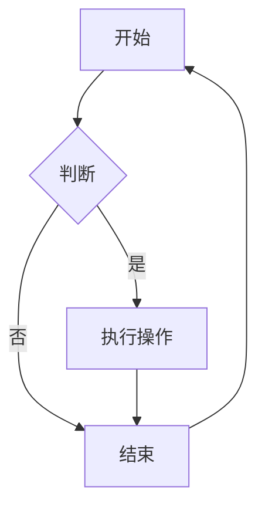

<!--
预设样式在style.less中完成
-->

# 一级标题[^1]

[^1]:这是一段脚注
</span>
>这是一段引用
$$
  \left\{
    \begin{aligned}
    \dot{\mathbf{q}}&=\{\mathbf{q},H\}=\frac{\partial H}{\partial \mathbf{p}}\\\\
    \dot{\mathbf{p}}&=\{\mathbf{p},H\}=-\frac{\partial H}{\partial\mathbf{q}}
    \end{aligned}
  \right.
$$ 
==以上是*正则关系*==

$$
  |a|=
\leftBrace
&a,\quad a>0,\\
-&a,\quad a\leq0.
\rightEnd
$$ 
<figure class="image-round" style="--image-width:80%">
  
  <figcaption>图1：Lain</figcaption>
</figure>

$$ \var(X)=E(X^2)-E^2(X),\quad a^{\dag} $$

<figure class="image-round" style="--image-width:40%">
  
  <figcaption>图二：gaslight</figcaption>
</figure>

<span class="kaiti"> 这是一个链接<a href="/Example/A2.md">Ex2</a>
</span>



```python
import numpy as np
def function(a,b):
  return np.abs(a-b)
```
<div id="pythagoras"></div>

$$
a^2 + b^2 = c^2
$$
