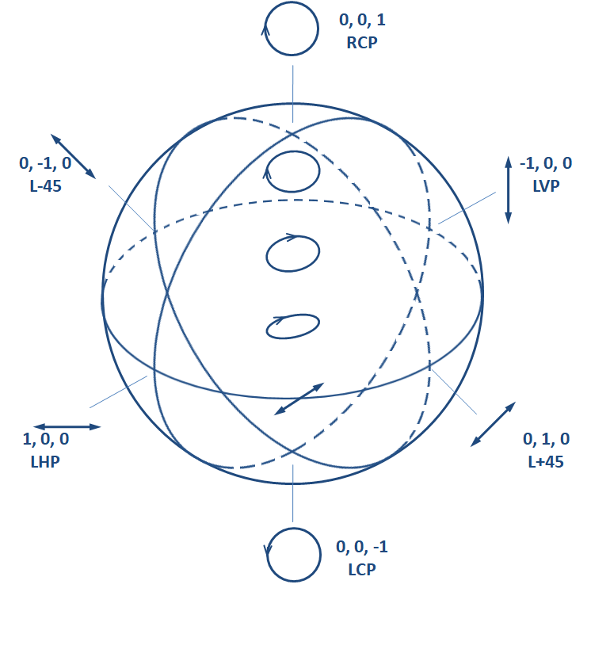
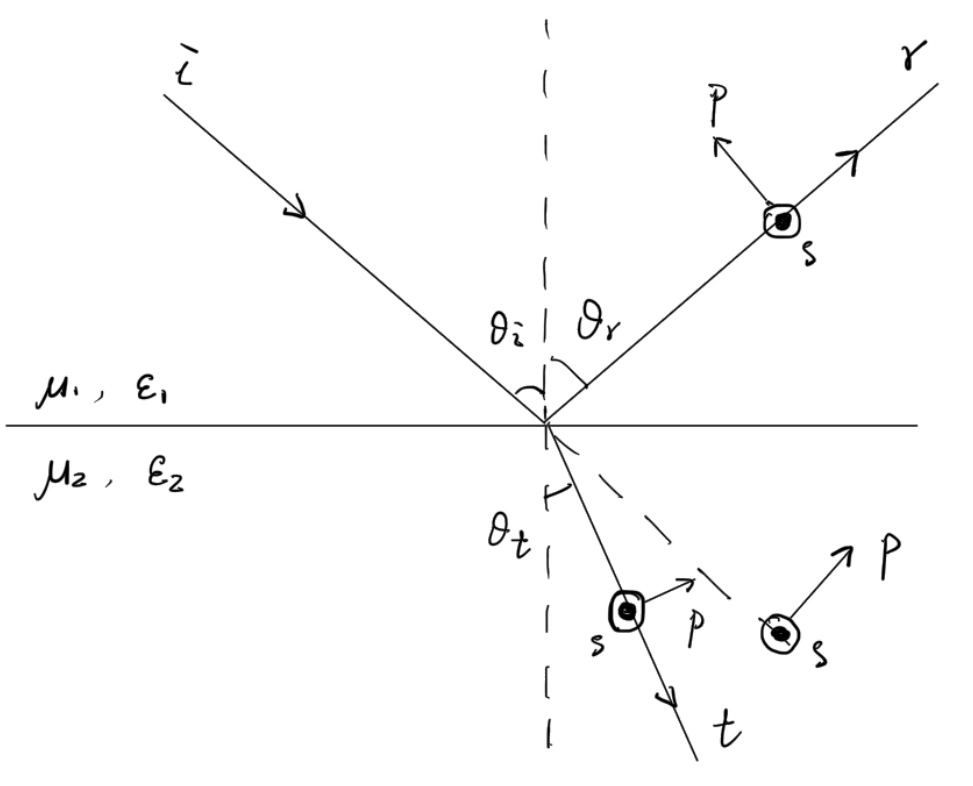

# 电磁波的传播

## 单色平面波

### 单色波

¶在无自由电流及电荷的线性均匀介质写出波动方程

$$
\nabla^2\bm{E}-\mu\varepsilon\frac{\partial ^2\bm{E}}{\partial t^2}=0,\quad
\nabla^2\bm{B}-\mu\varepsilon\frac{\partial ^2\bm{B}}{\partial t^2}=0,
$$

得到电磁波传播的相速度

$$
v_{p}=\frac{1}{\sqrt{\mu\varepsilon}}=\frac{c}{n}.
$$

¶处理单色波时引入复指数表示相位变化

$$
\bm{E}(\bm{r},t)=\operatorname{Re}\left[\tilde{\bm{E}}(\bm{r})\mathrm{e}^{-\mathrm{i}\omega t}\right],\quad
\bm{B}(\bm{r},t)=\operatorname{Re}\left[\tilde{\bm{B}}(\bm{r})\mathrm{e}^{-\mathrm{i}\omega t}\right],
$$

带入波动方程得到*Helmholtz*方程

$$
(\nabla^2+k^2)\tilde{\bm{E}}(\bm{r})=0,\quad(\nabla^2+k^2)\tilde{\bm{B}}(\bm{r})=0,
$$

得到波数$k=\omega/c$，并有关系

$$
\begin{equation}
\tilde{\bm{E}}(\bm{r})=\mathrm{i} v_{p}\frac{\nabla}{k}\times\tilde{\bm{B}}(\bm{r}),\quad\tilde{\bm{B}}(\bm{r})=\frac{1}{\mathrm{i} v\_{p}}\frac{\nabla}{k}\times\tilde{\bm{E}}(\bm{r}).
\end{equation}
$$

### 单色平面波的特征

¶在无界空间中无需考虑复杂的边界条件，得到单色平面波

$$
\tilde{\bm{E}}(\bm{r})=\tilde{\bm{E}}_{0}\mathrm{e}^{\mathrm{i}\bm{k}\cdot\bm{r}},
$$

其中波矢$\bm{k}=k\hat{\bm{e}}_{k}$.$\tilde{\bm{E}}_{0}$反应了电场强度的振幅与初始相位，决定了平面波的偏振态，且无散条件要求$\tilde{\bm{E}}_{0}\cdot\hat{\bm{e}}_{k}=0$.并由(1)式

$$
\begin{equation}
\tilde{\bm{B}}_{0}=\hat{\bm{e}}_{k}\times\frac{\tilde{\bm{E}}_{0}}{v_{p}}.
\end{equation}
$$

¶在电矢量的振动平面内取$\hat{\bm{e}}_{1}$和$\hat{\bm{e}}_{2}$，使得$(\hat{\bm{e}}_{1}\times\hat{\bm{e}}_{2})\cdot\hat{\bm{e}}_{k}=1$，设

$$
\tilde{\bm{E}}_{0}=\tilde{E}_{01}\hat{\bm{e}}_{1}+\tilde{E}_{02}\hat{\bm{e}}_{2},
$$

记$\delta_{j}=\arg\tilde{E}_{0j},\ j=1,2$，引入*Stokes*参量$(s_0,s_1,s_2,s_3)$

$$
\left\{\begin{aligned}
&s_{0}=|\tilde{E}_{01}|^2+|\tilde{E}_{02}|^2,\\
&s_{1}=|\tilde{E}_{01}|^2-|\tilde{E}_{02}|^2,\\
&s_{2}=2|\tilde{E}_{01}||\tilde{E}_{02}|\cos(\delta_{1}-\delta_{2}),\\
&s_{3}=2|\tilde{E}_{01}||\tilde{E}_{02}|\sin(\delta_{1}-\delta\_{2}),
\end{aligned}\right.
$$

<figure class="image-round" style="--image-width:60%">
  
  <figcaption>

图一：*Poincaré*球，三个轴依次为$s_{1,2,3}/s_{0}$

  </figcaption>
</figure>

在描述左旋圆偏光和右旋圆偏光时，引入$\hat{\bm{e}}_{\pm}=(\hat{\bm{e}}_{1}\pm\mathrm{i}\hat{\bm{e}}_{2})/\sqrt{2}$，则

$$
\tilde{\bm{E}}_{0}^{(\text{LCP})}=E_{0}\hat{\bm{e}}_{+},\quad\tilde{\bm{E}}_{0}^{(\text{RCP})}=E_{0}\hat{\bm{e}}_{-}.
$$

### 单色平面波的能量与动量

¶瞬时坡印廷矢量

$$
\begin{aligned}
\bm{S}&=\frac{1}{\mu}\bm{E}\times\bm{B}\\
&=\frac{1}{2\mu}\operatorname{Re}\left(\tilde{\bm{E}}\times\tilde{\bm{B}}^{*}+\tilde{\bm{E}}\times\tilde{\bm{B}}\mathrm{e}^{-2\mathrm{i}\omega t}\right)\\
&=\frac{1}{2\mu}\operatorname{Re}\left(\tilde{\bm{E}}_{0}\times\tilde{\bm{B}}_{0}^{*}+\tilde{\bm{E}}_{0}\times\tilde{\bm{B}}_{0}\mathrm{e}^{-2\mathrm{i}(\omega t-\bm{k}\cdot\bm{r})}\right)\\
&=\frac{\hat{\bm{e}}_{k}}{2\mu v_{p}}\|\tilde{\bm{E}}_{0}\|^2+\frac{\hat{\bm{e}}_{k}}{2\mu v_{p}}\operatorname{Re}\left(\tilde{\bm{E}}_{0}^{2}\mathrm{e}^{-2\mathrm{i}(\omega t-\bm{k}\cdot\bm{r})}\right),
\end{aligned}
$$

而瞬时能量密度

$$
w=\frac{1}{2}\left(\varepsilon\bm{E}^2+\frac{1}{\mu}\bm{B}^2\right)=\varepsilon\bm{E}^2=\frac{\varepsilon}{2}\|\tilde{\bm{E}}_{0}\|^2+\frac{\varepsilon}{2}\operatorname{Re}\left(\tilde{\bm{E}}_{0}^{2}\mathrm{e}^{-2\mathrm{i}(\omega t-\bm{k}\cdot\bm{r})}\right),
$$

即

$$
\bm{S}=\frac{w}{\mu\varepsilon v_{p}}\hat{\bm{e}}_{k}=w\bm{v}_{g},
$$

即对于平面单色波，群速度$\bm{v}_{g}=v_{p}\hat{\bm{e}}_{k}$.由以上推导，也可得平均能流密度

$$
\langle\bm{S}\rangle=\frac{1}{2}\tilde{\bm{E}}_{0}\times\tilde{\bm{H}}_{0}^{*}.
$$

¶*Minkowski*动量密度

$$
\bm{g}_{M}=\bm{D}\times\bm{B}=\frac{\bm{S}}{v_{p}^2},
$$

动量流密度

$$
\begin{aligned}
\mathcal{T}&=-\bm{D}\bm{E}-\bm{B}\bm{H}+\frac{1}{2}(\bm{D}\cdot\bm{E}+\bm{B}\cdot\bm{H})\mathcal{I}\\
&=\frac{1}{2}\left[\mathcal{T}_{0}^{C_{2}}+\operatorname{Re}\left(\mathcal{T}_{0}\mathrm{e}^{-2\mathrm{i}(\omega t-\bm{k}\cdot\bm{r})}\right)\right],
\end{aligned}
$$

其中$\mathcal{T}_{0}=-\tilde{\bm{D}}_{0}\tilde{\bm{E}}_{0}-\tilde{\bm{B}}_{0}\tilde{\bm{H}}_{0}+\frac{1}{2}(\tilde{\bm{D}}_{0}\cdot\tilde{\bm{E}}_{0}+\tilde{\bm{B}}_{0}\cdot\tilde{\bm{H}}_{0})\mathcal{I}$，$^{C_{2}}$表示对张量的第二个位置取复共轭.且有关系$\operatorname{Tr}(\mathcal{T}\_{0})=w$.

## 电磁波在介质分界面处的反射与折射

### *Fresnel*公式

¶考察单色平面波，其$\hat{\bm{e}}_{k}$与分界面法向量$\hat{\bm{e}}_{z}$张成入射面（Z-X平面），约定电矢量振动方向垂直入射面为s偏振(senkrecht)，平行入射面为p偏振(parallel).

<figure class="image-round" style="--image-width:60%">
  
  <figcaption>
  
  图二：*Fresnel*公式推导中电磁量正方向的设定
  </figcaption>
</figure>

¶假设分界面上无自由电荷和自由电流，根据边值关系

$$
\left\{\begin{aligned}
&E^{(\text{i})}_{s}+E^{(\text{r})}_{s}=E^{(\text{t})}_{s},\\
&H^{(\text{i})}_{s}+H^{(\text{r})}_{s}=H^{(\text{t})}_{s},\\
&(E^{(\text{i})}_{p})_{x}+(E^{(\text{r})}_{p})_{x}=(E^{(\text{t})}_{p})_{x},\\
&(H^{(\text{i})}_{p})_{x}+(H^{(\text{r})}_{p})_{x}=(H^{(\text{t})}_{p})_{x},
\end{aligned}\right.
$$

根据(2)式

$$
H_{p}=-\sqrt{\frac{\varepsilon}{\mu}}E_{s},\quad H_{s}=\sqrt{\frac{\varepsilon}{\mu}}E_{p},
$$

以上，待求量有$E_{p}^{(\text{r,t})},E_{s}^{(\text{r,t})},H_{p}^{(\text{r,t})},H_{s}^{(\text{r,t})}$共八个，可以被给定的八个方程求解，而$\theta_{r},\theta_{t}$已经根据*Snell*定律给出（或根据$D_{z}$和$B_{z}$连续补齐方程数目）.记波阻抗$Z=\sqrt{\mu/\varepsilon}$，解得

$$
\begin{equation}
\begin{aligned}
&E^{(\text{r})}_{p}=\frac{Z_{1}\cos\theta_{i}-Z_{2}\cos\theta_{t}}{Z_{1}\cos\theta_{i}+Z_{2}\cos\theta_{t}}E^{(\text{i})}_{p},\\
&E^{(\text{r})}_{s}=\frac{\cos\theta_{i}/Z_{1}-\cos\theta_{t}/Z_{2}}{\cos\theta_{i}/Z_{1}+\cos\theta_{t}/Z_{2}}E^{(\text{i})}_{s},\\
&E^{(\text{t})}_{p}=\frac{2Z_{2}\cos\theta_{i}}{Z_{1}\cos\theta_{i}+Z_{2}\cos\theta_{t}}E^{(\text{i})}_{p},\\
&E^{(\text{t})}_{s}=\frac{2\cos\theta_{i}/Z_{1}}{\cos\theta_{i}/Z_{1}+\cos\theta_{t}/Z_{2}}E^{(\text{i})}_{s},
\end{aligned}
\end{equation}
$$

正入射时不必区分p,s分量（针对$E^{(\text{r})}_{p}$修正p分量正方向的规定）

$$
E^{(\text{r})}=\frac{Z_{2}-Z_{1}}{Z_{1}+Z_{2}}E^{(\text{i})},\quad
E^{(\text{t})}=\frac{2Z_{2}}{Z_{1}+Z_{2}}E^{(\text{i})},
$$

在两侧介质均不发生磁响应时，$\mu_{1,2}=\mu_{0},\ Z\propto 1/n$,

$$
\begin{equation}
\begin{aligned}
&E^{(\text{r})}_{p}=\frac{\tan(\theta_{i}-\theta_{t})}{\tan(\theta_{i}+\theta_{t})}E^{(\text{i})}_{p},\\
&E^{(\text{r})}_{s}=\frac{\sin(\theta_{t}-\theta_{{i}})}{\sin(\theta_{t}+\theta_{{i}})}E^{(\text{i})}_{s},\\
&E^{(\text{t})}_{p}=\frac{2\cos\theta_{i}\sin\theta_{t}}{\sin(\theta_{i}+\theta_{t})\cos(\theta_{i}-\theta_{t})}E^{(\text{i})}_{p},\\
&E^{(\text{t})}_{s}=\frac{2\cos\theta_{i}\sin\theta_{t}}{\sin(\theta_{i}+\theta_{t})}E^{(\text{i})}\_{s}.
\end{aligned}
\end{equation}
$$

### 能流和动量流的反射与折射

¶用反射系数和透射系数描述能流分配

$$
R=\frac{\langle\bm{S}^{(\text{r})}\rangle\cdot\hat{\bm{e}}_{z}}{\langle\bm{S}^{(\text{i})}\rangle\cdot(-\hat{\bm{e}}_{z})}=\frac{\|\tilde{\bm{E}}_{0}^{(\text{r})}\|^2}{\|\tilde{\bm{E}}_{0}^{(\text{i})}\|^2},\quad T=\frac{\langle\bm{S}^{(\text{t})}\rangle\cdot(-\hat{\bm{e}}_{z})}{\langle\bm{S}^{(\text{i})}\rangle\cdot(-\hat{\bm{e}}_{z})}=\frac{\|\tilde{\bm{E}}_{0}^{(\text{t})}\|^2\cos\theta_{t}/Z_{2}}{\|\tilde{\bm{E}}_{0}^{(\text{i})}\|^2\cos\theta_{i}/Z_{1}},
$$

p,s分量上的$R,T$也如此定义.
¶计算非磁性材料正入射产生的光压，选取$x$与$\bm{E}^{(\text{i})}$同向

$$
\begin{aligned}
\bm{P}&=\frac{1}{S_{z}}\int_{\Sigma}\frac{\partial \bm{g}_{M}}{\partial t}\ \mathrm{d}^3\bm{r}'=-\frac{1}{S_{z}}\oint_{\partial\Sigma}\mathrm{d}\bm{f}'\cdot\langle\mathcal{T}\rangle\\
&=\hat{\bm{e}}_{z}\cdot(\langle\mathcal{T}^{(\text{t})}\rangle-\langle\mathcal{T}^{(\text{i})}\rangle-\langle\mathcal{T}^{(\text{r})})\rangle\\
&=\left[(\mathcal{T}^{(\text{t})}_{0})^{C_{2}}_{zz}-(\mathcal{T}^{(\text{i})}_{0})^{C_{2}}_{zz}-(\mathcal{T}^{(\text{r})}_{0})^{C_{2}}_{zz}\right]\hat{\bm{e}}_{z}\\
&=(w^{(\text{t})}-w^{(\text{i})}-w^{(\text{r})})\hat{\bm{e}}_{z}\\
&=(\varepsilon_{2}\|\tilde{\bm{E}}_{0}^{(\text{t})}\|^2-\varepsilon_{1}\|\tilde{\bm{E}}_{0}^{(\text{i})}\|^2-\varepsilon_{1}\|\tilde{\bm{E}}_{0}^{(\text{r})}\|^2)\hat{\bm{e}}_{z}\\
&=\left[\frac{Z_{1}^2}{Z_{2}^{2}}\left(\frac{2Z_{2}}{Z_{1}+Z_{2}}\right)^2-\left(\frac{Z_{2}-Z_{1}}{Z_{1}+Z_{2}}\right)^2-1\right]\varepsilon_{1}\|\tilde{\bm{E}}_{0}^{(\text{i})}\|^2\hat{\bm{e}}_{z}\\
&=\frac{Z_{1}-Z_{2}}{Z_{1}+Z_{2}}\frac{-2\bm{S}^{(\text{i})}}{v_{1}}=\frac{n_1-n_2}{n_1+n_2}\frac{2\bm{S}^{(\text{i})}}{v_{1}},
\end{aligned}
$$

可见光疏介质正入射向光密介质会产生背离入射方向的光压.

### *Brewster*角

¶由(3)式可知$\cos\theta_{i}^{(\text{E})}/Z_{1}=\cos\theta_{t}/Z_{2}$时反射光无s分量，结合折射定律$n_{1}\sin\theta_{i}^{(\text{E})}=n_{2}\sin\theta_{t}$消去$\theta_{t}$得

$$
\left(\frac{Z_{2}}{Z_{1}}\right)^{2}\cos^2\theta_{i}^{(\text{E})}+\left(\frac{n_{1}}{n_{2}}\right)^2\sin^2\theta_{i}^{(\text{E})}=1,
$$

即

$$
\tan^2\theta_{i}^{(\text{E})}=\frac{(Z_{2}/Z_{1})^{2}-1}{1-(n_{1}/n_{2})^{2}}>0,
$$

此时有非平凡的解，非磁性介质不符合此条件.
¶由(3)式可知$Z_{1}\cos\theta_{i}^{(\text{B})}=Z_{2}\cos\theta_{t}$时反射光无p分量，结合折射定律

$$
\left(\frac{Z_{1}}{Z_{2}}\right)^{2}\cos^2\theta_{i}^{(\text{B})}+\left(\frac{n_{1}}{n_{2}}\right)^2\sin^2\theta_{i}^{(\text{B})}=1,
$$

即

$$
\tan^2\theta_{i}^{(\text{E})}=\frac{(Z_{1}/Z_{2})^{2}-1}{1-(n_{1}/n_{2})^{2}}>0,
$$

对于非磁性介质$\tan\theta_{i}^{(\text{B})}=n_{2}/n_{1}$，$\theta_{i}^{(\text{B})}$为*Brewster*角.

### 倏逝波

¶当光从光密介质射向光疏介质$\sin\theta_{t}=n_{1}\sin\theta_{i}/n_{2}>1$时，$\theta_{t}$失去几何意义，反射系数$R=1$，发生全反射，记临界角$\sin\theta_{i}^{(\text{C})}=n_{2}/n_{1}$.此时研究透射波必须拓展波矢的定义，使得其分量可以为复数而保持$\|\bm{k}\|=k$即可.边值关系要求分界面上入射波和折射波宗量相等

$$
k^{(\text{t})}_{x}=k^{(\text{i})}\sin\theta_{i},\quad\omega=\frac{ck^{(\text{i})}}{n_{1}}=\frac{ck^{(\text{t})}}{n_{2}},
$$

则

$$
k^{(\text{t})}_{z}=-\sqrt{(k^{(\text{t})})^2-(k^{(\text{t})}_{x})^2}=-\mathrm{i} k^{(\text{i})}\sqrt{\sin^{2}\theta_{i}-\sin^{2}\theta_{i}^{(\text{C})}}\equiv-\mathrm{i}\kappa(\theta_{i}),
$$

得到折射波

$$
\bm{E}^{(\text{r})}=\tilde{E}^{(\text{t})}\exp[{-\mathrm{i}(\omega t-\bm{k}^{(\text{t})}\cdot\bm{r})}]=[\tilde{E}^{(\text{t})}\mathrm{e}^{\kappa(\theta_{i})z}]\exp[-\mathrm{i}(\omega t-k^{(\text{i})}\sin\theta_{i}x)],
$$

折射波有沿$-\hat{\bm{e}}_{z}$方向指数衰减的特点，称为倏逝波.取$1/e$振幅时$z=\kappa^{-1}$为穿透深度，则发生全反射还应要求折射介质厚度大于$\kappa^{-1}$，否则发生光学隧穿.

## 电磁波的色散

### *Kramers-Kronig*关系

¶在均匀线性介质中，因果律保证材料响应$\chi(\tau)=0, \forall\tau<0$使得电位移矢量可以被表示为

$$
\bm{D}(\bm{r},t)=\varepsilon_{0}\left[\bm{E}(\bm{r},t)+\int_{0}^{\infty}\chi(\tau)\bm{E}(t-\tau)\ \mathrm{d}\tau\right],
$$

且对$\chi(\tau)$作频谱分析

$$
\frac{\varepsilon(\omega)}{\varepsilon_{0}}=1+\frac{1}{\sqrt{2\pi}}\int_{0}^{\infty}\chi(\tau)\mathrm{e}^{-\mathrm{i}\omega\tau}\ \mathrm{d}\tau,
$$

若响应$\chi$有限，则在$\operatorname{Im}\omega<0$的下半平面$\varepsilon(\omega)$关于$\omega$一致收敛，故可以交换积分的顺序，那么根据复分析的*Morea*定理，$\varepsilon(\omega)$解析.由连续性$\chi(0)=\chi(0_{-})=0$，故$\varepsilon(\omega)/\varepsilon_{0}$在下半平面可展开为

$$
\frac{\varepsilon(\omega)}{\varepsilon_{0}}=1-\frac{\chi'(0)}{\sqrt{2\pi}\omega^2}+o(\omega^{-2}),
$$

应用*Cauchy*定理

$$
\frac{\varepsilon(\omega)}{\varepsilon_{0}}-1=-\frac{1}{2\pi\mathrm{i}}\oint_{C}\frac{\varepsilon(\omega')/\varepsilon_{0}-1}{\omega'-\omega}\ \mathrm{d}\omega'=-\frac{1}{2\pi\mathrm{i}}\int_{-\infty}^{\infty}\frac{\varepsilon(\omega')/\varepsilon_{0}-1}{\omega'-\omega}\ \mathrm{d}\omega',
$$

其中$C$是实轴和下半平面半圆构成的顺时针围道.选取实轴上一点$\omega_{0}$使得$\omega=\omega_{0}-\mathrm{i}\delta,\ \delta\to0_{+}$，由*Sokhotski–Plemelj*公式

$$
\frac{1}{\omega'-\omega_{0}+\mathrm{i}\delta}=\mathcal{P}\frac{1}{\omega'-\omega_{0}}-\mathrm{i}\pi\delta(\omega'-\omega_{0}),
$$

于是

$$
\frac{\varepsilon(\omega_{0})}{\varepsilon_{0}}-1=-\frac{1}{\pi\mathrm{i}}\mathcal{P}\int_{-\infty}^{\infty}\frac{\varepsilon(\omega')/\varepsilon_{0}-1}{\omega'-\omega_{0}}\ \mathrm{d}\omega',
$$

即

$$
\begin{aligned}
&\operatorname{Re}\frac{\varepsilon(\omega_{0})}{\varepsilon_{0}}=1-\frac{1}{\pi}\mathcal{P}\int_{-\infty}^{\infty}\frac{\operatorname{Im}\varepsilon(\omega')/\varepsilon_{0}}{\omega'-\omega_{0}}\ \mathrm{d}\omega',\\
&\operatorname{Im}\frac{\varepsilon(\omega_{0})}{\varepsilon_{0}}=\frac{1}{\pi}\mathcal{P}\int_{-\infty}^{\infty}\frac{\operatorname{Re}\varepsilon(\omega')/\varepsilon_{0}}{\omega'-\omega_{0}}\ \mathrm{d}\omega'.
\end{aligned}
$$

### 导电介质中的电磁波

¶在处理单色平面波问题时

$$
\nabla\cdot\to\mathrm{i}\bm{k}\cdot,\quad\nabla\times\to\mathrm{i}\bm{k}\times,\quad\frac{\partial }{\partial t}\to-\mathrm{i}\omega,
$$

再利用*Ohm*定律，则电中性导电介质中有

$$
\begin{aligned}
&\bm{k}\cdot\tilde{\bm{E}}_{0}=0,\\
&\bm{k}\times\tilde{\bm{E}}_{0}=\omega\tilde{\bm{B}}_{0},\\
&\bm{k}\cdot\tilde{\bm{B}}_{0}=0,\\
&\bm{k}\times\tilde{\bm{B}}_{0}=-\mu_{0}\omega\left(\varepsilon+\mathrm{i}\frac{\sigma}{\omega}\right)\tilde{\bm{E}}_{0},
\end{aligned}
$$

引入等效介电常数

$$
\varepsilon_{\text{eff}}=\varepsilon+\mathrm{i}\frac{\sigma}{\omega},
$$

可解得波矢满足

$$
\bm{k}^2=\omega^2\mu_{0}\varepsilon_{\text{eff}}=k_{0}^2\frac{\varepsilon_{\text{eff}}}{\varepsilon_{0}}.
$$

设波矢

$$
\bm{k}=\bm{\beta}+\mathrm{i}\bm{\alpha},
$$

则

$$
\bm{\beta}^2-\bm{\alpha}^2=\frac{\varepsilon}{\varepsilon_{0}},\quad\bm{\beta}\cdot\bm{\alpha}=\frac{k_{0}\sigma}{2\omega},
$$

正入射时$\bm{\beta}\parallel\bm{\alpha}$，解得

$$
\bm{\beta},\bm{\alpha}=\bm{k}_{0}\sqrt{\frac{\varepsilon}{2\varepsilon_{0}}}\left[
\sqrt{1+\left(\frac{\sigma}{\omega\varepsilon}\right)^2}\pm1\right]^{1/2}.
$$

### 经典唯象模型

#### *Lorenz*模型

¶*Lorenz*模型描述介质中的电本构关系，假定外单色电场作用下，介质中束缚电子遵从运动规律

$$
m\ddot{\bm{x}}=-m\omega_{0}^2\bm{x}-m\gamma\dot{\bm{x}}-e\bm{E}_{0}\mathrm{e}^{-\mathrm{i}\omega t},
$$

其稳定解

$$
\bm{x}=-\frac{e}{m}\frac{1}{\omega_{0}^2-\omega^2-\mathrm{i}\gamma\omega}\bm{E}_{0}\mathrm{e}^{-\mathrm{i}\omega t},
$$

得到相对介电常数

$$
\varepsilon_{r}=\frac{P}{\varepsilon_{0}E}=\frac{-Nex}{\varepsilon_{0}E}=\frac{Ne^2/\varepsilon_{0}m}{\omega_{0}^2-\omega^2-\mathrm{i}\gamma\omega}\equiv\frac{\omega_{p}^2}{\omega_{0}^2-\omega^2-\mathrm{i}\gamma\omega},
$$

称$\omega_{0}$为材料谐振本证频率，$\omega\_{p}$为材料的体等离子频率，$\gamma$为阻尼系数.

#### *Drude*模型

¶*Drude*模型采用带电粒子气近似金属导体

$$
m\ddot{\bm{x}}=-m\gamma\dot{\bm{x}}-e\bm{E}_{0}\mathrm{e}^{-\mathrm{i}\omega t},
$$

阻力来源于粒子间的散射，假定自由程一定，阻力项便与$\dot{\bm{x}}$成正比，$\gamma^{-1}$表示弛豫时间，得到稳定解

$$
\bm{x}=\frac{e}{m}\frac{1}{\omega^2+\mathrm{i}\gamma\omega}\bm{E}_{0}\mathrm{e}^{-\mathrm{i}\omega t},
$$

导电率

$$
\sigma=\frac{J_{f}}{E}=\frac{-Ne\dot{x}}{E}=\frac{\varepsilon_{0}\omega_{p}^2}{\gamma-\mathrm{i}\omega},
$$

得到

$$
\varepsilon_{r}=\frac{\varepsilon_{\text{eff}}}{\varepsilon_{0}}=1-\frac{\omega\_{p}^2}{\omega^2+\mathrm{i}\gamma\omega}.
$$

### 金属导体的穿透深度

¶由*Drude*模型，金属的相对介电常数

$$
\varepsilon_{r}=1-\frac{\omega_{p}^2}{\omega^2+\gamma^2}+\mathrm{i}\frac{\omega_{p}^2\gamma}{\omega(\omega^2+\gamma^2)},
$$

且

$$
\bm{\beta},\bm{\alpha}=\bm{k}_{0}\sqrt{\frac{\varepsilon_{r}'}{2}}\left[
\sqrt{1+\left(\frac{\varepsilon_{r}''}{\varepsilon_{r}'}\right)^2}\pm1\right]^{1/2}.
$$

金属一般满足$\gamma\ll\omega_{p}$.$\omega<\omega_{p}$时，$\alpha,\beta$为虚数，物理含义对调，此时$\delta=\beta^{-1}$表示穿透深度.由(3)知，由真空向金属导体正入射时

$$
\frac{E^{(\text{r})}}{E^{(\text{i})}}=\frac{Z_2-Z_1}{Z_1+Z_2}=\frac{k_0-(\beta+\mathrm{i}\alpha)}{k_0+\beta+\mathrm{i}\alpha},
$$

反射系数

$$
R=\frac{\|E^{(\text{r})}\|^2}{\|E^{(\text{i})}\|^2}=\frac{(k_0-i\alpha)^2-\beta^2}{(k_0+\mathrm{i}\alpha)^2-\beta^2}.
$$

¶在可见光波段$\varepsilon_{r}''/|\varepsilon_{r}'|=\gamma/\omega\ll1$

$$
\beta\approx\mathrm{i}\sqrt{|\varepsilon_{r}'|}k_{0},\quad\alpha=\mathrm{i}\frac{\varepsilon_{r}''}{|\varepsilon_{r}'|}\frac{\sqrt{|\varepsilon_{r}'|}k_{0}}{2},
$$

此时$R\approx1$.
¶而在低频波段$\varepsilon_{r}''/|\varepsilon_{r}'|=\gamma/\omega\ggg1$

$$
\beta\approx\alpha\approx k_{0}\sqrt{\frac{|\varepsilon_{r}'|}{2}}\frac{\varepsilon_{r}''}{|\varepsilon_{r}'|},
$$

此时也有$R\approx1$，且$\delta\approx0$，可被当作理想导体.
¶在紫外波段，$\beta,\alpha$为实数，$\beta\approx k_{0},\ \alpha\ll1$

$$
R=\frac{(k_0-\beta)^2+\alpha^2}{(k_0+\beta)^2+\alpha^2}\approx0,
$$

金属几乎不与波作用，称为紫外透明.

## 电磁波传播的实例

### 波导

#### 导模的特点

¶假设波导管沿$z$轴方向，则无损耗单色波的振幅不依赖$z$

$$
\left\{
\begin{matrix}
\bm{E}(\bm{r},t)\\
\bm{H}(\bm{r},t)
\end{matrix}
\right\}
=\operatorname{Re}\left\{
\begin{matrix}
\tilde{\bm{E}}(x,y)\\
\tilde{\bm{H}}(x,y)
\end{matrix}
\right\}\mathrm{e}^{-\mathrm{i}(\omega t-k_{z}z)},
$$

带入*Helmholtz*方程

$$
\begin{equation}
\left(\frac{\partial ^2}{\partial x^2}+\frac{\partial ^2}{\partial y^2}+k^2-k_{z}^2\right)
\left\{
\begin{matrix}
\tilde{\bm{E}}(x,y)\\
\tilde{\bm{H}}(x,y)
\end{matrix}
\right\}=0,
\end{equation}
$$

记$k_{t}^2=k^2-k_{z}^2$，利用

$$
\frac{\partial }{\partial z}\to\mathrm{i} k_{z},\quad\frac{\partial }{\partial t}\to-\mathrm{i}\omega,
$$

以及关于$x,y$方向的$\bm{E},\bm{H}$旋度方程，得到

$$
\begin{equation}
\begin{aligned}
&\tilde{E}_{x}=\frac{\mathrm{i}}{k_{t}^2}\left(k_{z}\frac{\partial \tilde{E}_{z}}{\partial x}+\omega\mu\frac{\partial \tilde{H}_{z}}{\partial y}\right),
&\tilde{E}_{y}=\frac{\mathrm{i}}{k_{t}^2}\left(k_{z}\frac{\partial \tilde{E}_{z}}{\partial y}-\omega\mu\frac{\partial \tilde{H}_{z}}{\partial x}\right),\\
&\tilde{H}_{x}=\frac{\mathrm{i}}{k_{t}^2}\left(k_{z}\frac{\partial \tilde{H}_{z}}{\partial x}-\omega\varepsilon\frac{\partial \tilde{E}_{z}}{\partial y}\right),
&\tilde{H}_{y}=\frac{\mathrm{i}}{k_{t}^2}\left(k_{z}\frac{\partial \tilde{H}_{z}}{\partial y}+\omega\varepsilon\frac{\partial \tilde{H}_{z}}{\partial x}\right),
\end{aligned}
\end{equation}
$$

这说明$k_{t}\neq0$时波导不支持TEM(Transverse ElectroMagnetic)导模.$k_{t}=0$时设TEM模存在，得到$\nabla\times\tilde{\bm{E}}(x,y)=0$，则引入标量场$\tilde{\varphi}(x,y)$，其满足*Laplace*方程

$$
\nabla^2\tilde{\varphi}(x,y)=0,
$$

复分析指出这类调和函数的模的最值必在边界取得.故对于单边界波导，波导内$\tilde{\varphi}=\text{const}.$，不存在TEM模；而对于双边界波导，可存在TEM模.

#### 矩形波导管中的TE模

¶由(6)式知，场的各个分量决定于$\tilde{H}_{z}$，分离变量$\tilde{H}_{z}(x,y)=X(x)Y(y)$，带入(5)式

$$
\frac{1}{X}\frac{\mathrm{d}^2X}{\mathrm{d}x^2}+\frac{1}{Y}\frac{\mathrm{d}^2Y}{\mathrm{d}y^2}+k_{t}^2=0,
$$

解得

$$
\tilde{H}_{z}=(A_{1}\cos k_{x}x+B_{1}\sin k_{x}x)(A_{2}\cos k_{y}y+B_{2}\sin k_{y}y),
$$

其中$k_{x}^2+k_{y}^2=k_{t}^2$，考虑区域$[0,a]\times[0,b]$的边界条件

$$
\tilde{E}_{x}|_{y=0,b}=0,\quad \tilde{E}_{y}|_{x=0,a}=0,
$$

得到

$$
\tilde{H}_{z}=\tilde{H}_{0}\cos\frac{m\pi}{a}x\cos\frac{n\pi}{b}y,\quad m,n=0,1,\cdots\text{且}(m-1)(n-1)\neq1,
$$

并有

$$
\begin{equation}
k_{z}=\sqrt{k^2-k_{x}^2-k_{y}^2}=\sqrt{\mu\varepsilon\omega^2-\left(\frac{m\pi}{a}\right)^2-\left(\frac{n\pi}{b}\right)^2},
\end{equation}
$$

可见TE$\_{mn}$模的传播要求$\omega$大于一定的截止频率.

#### 矩形波导管中的TM模

¶仿照上一小节，直接利用边界条件$\tilde{E}_{y}|_{x=0,a}=\tilde{E}_{x}|_{y=0,b}=0$解得

$$
\tilde{E}_{z}=\tilde{E}_{0}\sin\frac{m\pi}{a}x\sin\frac{n\pi}{b}y,\quad m,n=0,1,\cdots\text{且}mn\neq0.
$$

#### 圆形同轴波导中的TEM模

¶此时$k=k_{z}$，调和场$\tilde{\varphi}(r,\varphi)$为

$$
\tilde{\varphi}=a_{0}+b_{0}\ln r,
$$

设内外面电势分别为$\varphi_{1},\varphi_{2}$，内外径$r_{1},r_{2}$，则

$$
\begin{aligned}
&\tilde{\bm{E}}(r,\varphi)=-\nabla\varphi=-b_{0}\frac{\hat{\bm{e}}_{r}}{r}=-\frac{\varphi_{1}-\varphi_{2}}{\ln r_{1}/r_{2}}\frac{\hat{\bm{e}}_{r}}{r},\\
&\tilde{\bm{B}}(r,\varphi)=\frac{k_{z}\hat{\bm{e}}_{z}\times\tilde{\bm{E}}}{\omega}=-\frac{\varphi_{1}-\varphi_{2}}{\ln r_{1}/r_{2}}\frac{\sqrt{\mu\varepsilon}\hat{\bm{e}}_{\varphi}}{r},
\end{aligned}
$$

#### 导模的参数

¶由(7)式可知，TE$_{mn}$和TM$_{mn}$具有相同的色散特征，会发生简并，而由于不存在TM$_{m0}$和TM$_{0n}$，故TE$_{m0}$和TE$_{0n}$为非简并.
¶改写(7)式为

$$
k_{z}=\sqrt{\mu\varepsilon}\sqrt{\omega^2-(\omega_{mn}^{(\text{cut})})^2},
$$

相速度

$$
v_{p}=\frac{\omega}{k_{z}}=\frac{1}{\sqrt{1-\left(\frac{\omega_{mn}^{(\text{cut})}}{\omega}\right)^2}}\frac{c}{n},
$$

群速度

$$
v_{g}=\frac{\mathrm{d}\omega}{\mathrm{d}k_{z}}=1\left/\frac{\mathrm{d}k_{z}}{\mathrm{d}\omega}\right.=\sqrt{1-\left(\frac{\omega_{mn}^{(\text{cut})}}{\omega}\right)^2}\frac{c}{n},
$$

得到关系

$$
v_{p}v\_{g}=\left(\frac{c}{n}\right)^2.
$$

### 谐振腔

¶金属谐振腔常用于激发高频电磁波.设长方体谐振腔$[0,a]\times[0,b]\times[0,d]$内的TE$_{mn}$模为

$$
\tilde{H}_{z}=\tilde{H}_{0}\cos\frac{m\pi}{a}x\cos\frac{n\pi}{b}y\left[C\mathrm{e}^{ik_{z}z}+C'\mathrm{e}^{-\mathrm{i} k_{z}z}\right],
$$

引入边界条件

$$
\tilde{H}_{z}|_{z=0,d}=0,
$$

解得

$$
\tilde{H}_{z}=\tilde{H}_{0}\cos\frac{m\pi}{a}x\cos\frac{n\pi}{b}y\sin\frac{l\pi}{d}z,\quad l=0,1,\cdots
$$

最低模指数$(m,n,l)=(1,0,1),(0,1,1)$.同理，对于TM模引入边界条件

$$
\tilde{E}_{x,y}|_{z=0,d}=0,
$$

得到

$$
\tilde{E}_{z}=\tilde{E}_{0}\sin\frac{m\pi}{a}x\sin\frac{n\pi}{b}y\cos\frac{l\pi}{d}z,
$$

最低模指数$(m,n,l)=(1,1,0)$.
