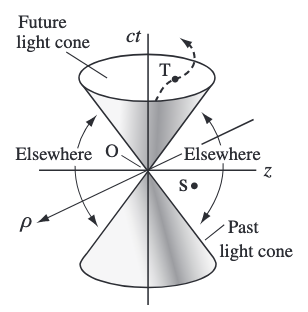

# 狭义相对论

## 公设

¶​记*Minkowski*空间中的四维时空逆变矢量$|x\rangle=x^{\mu}=(x^{0},\bm{x})\equiv(ct,x^1,x^2,x^3)$，约定度规$g_{\mu\nu}=g^{\mu\nu}=\operatorname{diag}(1,-1,-1,-1)$，对应的协变矢量$\langle x|=x_{\mu}=g_{\mu\nu}x^{\nu}=(x^{0},-\bm{x})$.

¶​四维矢量代表着当前参考系下的世界点或事件(world point, event)，世界点连缀而成的线称为世界线(world line).在两个时空点$A$和$B$间定义时空间隔

$$
\Delta s_{AB}^2=\langle x_{B}-x_{A}|x_{B}-x_{A}\rangle=c^2(t_{B}-t_A)^2-\sum_{i=1}^{3}(x_{B}^{i}-x_{A}^{i})^2.
$$

若$\Delta s_{AB}^2=0$称为类光间隔(light-like separation)或零间隔(null separation)，$\Delta s_{AB}^2>0$称为类时间隔(time-like separation)，$\Delta s_{AB}^2<0$称为类空间隔(space-like separation).描述真实发生的世界线常用光锥概念：时间线只能在类时区域（光锥）内部或边界上（分别对应亚光速粒子和光子）.

<figure class="image-round" style="--image-width:40%">
  
  <figcaption>
  
  图一：光锥示意图
  </figcaption>
</figure>
¶​狭义相对论建立在以下两条公设之上

- Postulate I:在任何惯性系中，真空光速均为$c$.$c$是自然常数.
- Postulate II:自然规律不依赖于惯性系的选取.（相对性原理，隐含时空的均匀性与各向同性）.

## *Lorenz*变换与相对论力学

### *Lorenz*变换

#### *Lorenz*群

¶​由于时空的均匀性与各向同性，两个惯性参考系$K$与$K'$间的变换必须是线性的（或者考虑$K$中的匀速直线运动必须在$K'$也被描述为匀速直线运动，这样确定了变换必须为射影变换，再考虑将时空点从有限远映射到无穷远的不可能性，故变换必为线性变换）

$$
x'^{\mu}=\Lambda^{\mu}_{\sigma}x^{\sigma}+a^{\sigma},\quad\Lambda^{\mu}_{\sigma}\in M_{4}(\mathbb{R}),a^{\sigma}\in\mathbb{R}^4.
$$

¶​考虑在$K$和$K'$描述同一个类光间隔

$$
\langle x_{B}-x_{A}|x_{B}-x_{A}\rangle=\langle x'_{B}-x'_{A}|x'_{B}-x'_{A}\rangle=0,
$$

即

$$
\begin{equation}
\Lambda^{\mu}_{\sigma}g_{\mu\nu}\Lambda^{\nu}_{\tau}=\alpha g_{\sigma\tau},
\end{equation}
$$

为使变换与一系列事实相符，$\alpha=1$，可知任意时空间隔变换前后保持不变.
¶​由上式知

$$
(\det\bm{\Lambda})^2=1,\quad(\Lambda_{0}^{0})^2\geq1,
$$

若$\Lambda_{0}^{0}\geq1$，则称$\bm{\Lambda}$为保时向的(orthochronous)，$\bm{\Lambda}\in L^{\uparrow}$.若$\det\bm{\Lambda}=1$，则称$\bm{\Lambda}$为正常的(proper)，$\bm{\Lambda}\in L_{+}$.其中$L$表示不包含时空平移项$a^{\sigma}$的齐次*Lorenz*群(homogeneous Lorenz group)，其子群$\{\bm{E},\bm{P},\bm{T},\bm{PT}\}$称为*Klein*四元群

$$
\begin{aligned}
&\bm{E}=\operatorname{diag}(1,1,1,1)\in L^{\uparrow}_{+},\quad\bm{P}=\operatorname{diag}(1,-1,-1,-1)\in L^{\uparrow}_{-},\\
&\bm{T}=\operatorname{diag}(-1,1,1,1)\in L^{\downarrow}_{-},\quad\bm{PT}=\operatorname{diag}(-1,-1,-1,-1)\in L^{\downarrow}_{+}.
\end{aligned}
$$

¶​在*Klein*四元群的帮助下，$L$被分为四个陪集，其中$L^{\uparrow}_{+}$构成一个子群，故可将注意集中至$L^{\uparrow}_{+}$的研究.

#### 三维空间转动和特殊*Lorenz*变换(boosts)

¶​考虑以下*Lorenz*变换

$$
\bm{\Lambda}(\bm{R})\equiv\mathcal{R}=1\oplus\bm{R},\quad\bm{R}\in\text{SO}(3),
$$

表示空间旋转，且由于$\det\mathcal{R}=\det\bm{R}=1$，$\mathcal{R}\in L^{\uparrow}_{+}$.
¶​再考虑时空间发生联系而坐标不旋转的特殊*Lorenz*变换，$K$与$K'$系的原点坐标应满足$\bm{x}'_{O'}=\bm{x}_{O'}-\bm{v}t$（由于在齐次*Lorenz*群中研究，没有时空平移项）.令$\bm{v}=v\hat{\bm{e}}_{1}$,$z^{\mu}=x^{\mu}-x_{O}^{\mu}$,$z'^{\mu}=x'^{\mu}-x'^{\mu}_{O'}$，由时空间隔的不变性（并注意因为正交坐标系中沿轴运动的独立性，$z^{2,3},z'^{2,3}$不与时间纠缠）

$$
  (z^{0})^2-(z^{1})^2=(z^0+z^1)(z^0-z^1)=\text{invariant of }v,
$$

故可假设

$$
z'^0+z'^1=\phi(v)(z^0+z^1),\quad z'^0-z'^1=\frac{1}{\phi(v)}(z^0-z^1),
$$

那么

$$
\begin{aligned}
x'^{1}_{O'}=z'^{1}_{O'}&=\frac{1}{2}\left(\phi(v)-\frac{1}{\phi(v)}\right)z^0_{O'}+\frac{1}{2}\left(\phi(v)+\frac{1}{\phi(v)}\right)z^1_{O'}\\
&=\frac{z^0_{O'}}{2\phi(v)}\left[(\phi^2(v)-1)+\frac{v}{c}(\phi^2(v)+1)\right]=0,
\end{aligned}
$$

得

$$
\phi(v)=\sqrt{\frac{1-v/c}{1+v/c}},
$$

记$\beta=v/c,\ \gamma=1/\sqrt{1-\beta^2}$

$$
\left(\begin{matrix}z'^0\\z'^1\end{matrix}\right)= \gamma\left(\begin{matrix}1&-\beta\\-\beta&1\end{matrix}\right)\left(\begin{matrix}z^0\\z^1\end{matrix}\right),
$$

记快度(rapidity)$\tanh\eta=\beta$

$$
\bm{\Lambda}(-v\hat{\bm{e}}_{1})=\left(\begin{matrix}\gamma&-\gamma\beta&0&0\\
-\gamma\beta&\gamma&0&0\\
0&0&1&0\\
0&0&0&1\end{matrix}\right)=\left(\begin{matrix}
\cosh\eta&-\sinh\eta&0&0\\
-\sinh\eta&\cosh\eta&0&0\\
0&0&1&0\\
0&0&0&1\end{matrix}\right).
$$

$-v\hat{\bm{e}}_{1}$中负号代表被动变换.
¶​将特殊*Lorenz*变换推广至任意*Lorenz*变换，采用旋转至速度方向进行变换后再撤回旋转的策略

$$
\bm{\Lambda}(-\bm{v})=\mathcal{R}^{T}\bm{\Lambda}(-v\hat{\bm{e}}_{1})\mathcal{R},
$$

即对于空间坐标

$$
\bm{z}'=\bm{z}_{\perp}+\gamma(\bm{z}_{\parallel}-\bm{v}t)=\bm{z}+(\gamma-1)\frac{\bm{z}\cdot\bm{v}}{v^2}\bm{v}-\gamma\bm{v}t,
$$

对于时间坐标

$$
z'^{0}=\gamma\left(z^{0}-\beta z_{\parallel}\right)=\gamma\left(z^{0}-\frac{1}{c}\bm{v}\cdot\bm{z}\right),
$$

于是

$$
\begin{equation}
\bm{\Lambda}(-\bm{v})=\left(\begin{matrix}
\gamma&-\gamma\dfrac{v^{j}}{c}\\\\
-\gamma \dfrac{v^{i}}{c}&\delta^{ij}+\dfrac{\gamma^2}{1+\gamma}\dfrac{v^{i}v^{j}}{c^2}
\end{matrix}\right).
\end{equation}
$$

#### *Lorenz*变换的分解

¶​对$\bm{\Lambda}\in L^{\uparrow}_{+}$有唯一分解定理

$$
\bm{\Lambda}=\bm{\Lambda}(\bm{v})\bm{\Lambda}(\bm{R}),\quad\frac{v^{i}}{c}=\frac{\Lambda^{i}_{0}}{\Lambda^{0}_{0}},\ R^{ij}=\Lambda^{i}_{j}-\frac{1}{1+\Lambda^{0}_{0}}\Lambda^{i}_{0}\Lambda^{0}_{j}.
$$

按上式计算$\bm{\Lambda}(\bm{v})$，由(1)式

$$
\begin{aligned}
&(\Lambda_{0}^{0})^2-\sum_{k=1}^{3}(\Lambda_{0}^{k})^2=1,\\
&\Lambda_{0}^{0}\Lambda_{i}^{0}-\sum_{k=1}^{3}\Lambda_{0}^{k}\Lambda_{i}^{k}=0,\\
&\Lambda_{i}^{0}\Lambda_{j}^{0}-\sum_{k=1}^{3}\Lambda_{i}^{k}\Lambda_{j}^{k}=-\delta_{ij},
\end{aligned}
$$

而

$$
\frac{\bm{v}^2}{c^2}=\frac{(\Lambda^{0}_{0})^2-1}{(\Lambda^{0}_{0})^2}<1,
$$

说明速度合理.得到

$$
\bm{\Lambda}(\bm{v})=\left(\begin{matrix}
\Lambda^{0}_{0}&\Lambda^{j}_{0}\\\\
\Lambda^{i}_{0}&\delta^{ij}+\dfrac{\Lambda^{i}_{0}\Lambda^{j}_{0}}{1+\Lambda_{0}^{0}}
\end{matrix}\right).
$$

设$\mathcal{R}=\bm{\Lambda}^{-1}(\bm{v})\bm{\Lambda}=\bm{\Lambda}(-\bm{v})\bm{\Lambda}$，可分解性的证明等价于验证$\mathcal{R}\in1\oplus\text{SO}(3)$

$$
\begin{aligned}
\mathcal{R}&=\left(\begin{matrix}
\Lambda^{0}_{0}&-\Lambda^{j}_{0}\\\\
-\Lambda^{i}_{0}&\delta^{ij}+\dfrac{\Lambda^{i}_{0}\Lambda^{j}_{0}}{1+\Lambda_{0}^{0}}
\end{matrix}\right)
\left(\begin{matrix}
\Lambda^{0}_{0}&\Lambda^{0}_{j}\\
\Lambda^{i}_{0}&\Lambda^{i}_{j}
\end{matrix}\right)\\
&=\left(\begin{matrix}
(\Lambda^{0}_{0})^{2}-\sum_{k=1}^{3}(\Lambda_{0}^{k})^2&
\Lambda_{0}^{0}\Lambda^{0}_{j}-\sum_{k=1}^{3}\Lambda_{0}^{k}\Lambda_{j}^{k}\\\\
-\Lambda_{0}^{0}\Lambda^{i}_{0}+\sum_{k=1}^{3}\left(\delta^{ik}+\dfrac{\Lambda^{i}_{0}\Lambda^{k}_{0}}{1+\Lambda_{0}^{0}}\right)\Lambda^{k}_{0}&-\Lambda_{0}^{i}\Lambda^{0}_{j}+\sum_{k=1}^{3}\left(\delta^{ik}+\dfrac{\Lambda^{i}_{0}\Lambda^{k}_{0}}{1+\Lambda_{0}^{0}}\right)\Lambda^{k}_{j}
\end{matrix}\right)\\
&=\left(\begin{matrix}
1&
\bm{0}_{1\times3}\\\\
\Lambda^{i}_{0}\left(-\Lambda_{0}^{0}+1+\dfrac{\sum_{k=1}^{3}(\Lambda^{k}_{0})^{2}}{1+\Lambda_{0}^{0}}\right)&-\Lambda_{0}^{i}\Lambda^{0}_{j}+\Lambda^{i}_{j}+\dfrac{\Lambda^{i}_{0}\sum_{k=0}^{3}\Lambda^{k}_{0}\Lambda^{k}_{j}}{1+\Lambda_{0}^{0}}
\end{matrix}\right)\\
&=\left(\begin{matrix}
1&
\bm{0}_{1\times3}\\\\
\bm{0}_{3\times1}&\Lambda^{i}_{j}-\dfrac{1}{1+\Lambda^{0}_{0}}\Lambda^{i}_{0}\Lambda^{0}_{j}
\end{matrix}\right),
\end{aligned}
$$

而

$$
\begin{aligned}
\mathcal{R}_{ki}\mathcal{R}_{kj}&=\left(\Lambda^{k}_{i}-\dfrac{1}{1+\Lambda^{0}_{0}}\Lambda^{k}_{0}\Lambda^{0}_{i}\right)\left(\Lambda^{k}_{j}-\dfrac{1}{1+\Lambda^{0}_{0}}\Lambda^{k}_{0}\Lambda^{0}_{j}\right)\\
&=\Lambda^{k}_{i}\Lambda^{k}_{j}+\frac{(\Lambda_{0}^{k})^2}{(1+\Lambda_{0}^{0})^2}\Lambda^{0}_{i}\Lambda^{0}_{j}-\frac{\Lambda^{k}_{0}}{1+\Lambda_{0}^{0}}(\Lambda^{k}_{i}\Lambda^{0}_{j}+\Lambda^{k}_{j}\Lambda^{0}_{i})\\
&=\delta_{ij}+\Lambda^{0}_{i}\Lambda^{0}_{j}\left(1+\frac{\Lambda^{0}_{0}-1}{1+\Lambda_{0}^{0}}-\frac{2\Lambda^{0}_{0}}{1+\Lambda_{0}^{0}}\right)=\delta_{ij},
\end{aligned}
$$

故

$$
\mathcal{R}=\bm{\Lambda}(\bm{R})\in1\oplus\text{SO}(3).
$$

证明唯一性，设$\bm{\Lambda}=\bm{\Lambda}(\bm{v})\bm{\Lambda}(\bm{R})=\bm{\Lambda}(\bm{v}')\bm{\Lambda}(\bm{R}')$，即

$$
\bm{1}_{4\times4}=\bm{\Lambda}(-\bm{v})\bm{\Lambda}\bm{\Lambda}(\bm{R}^{T})=\bm{\Lambda}(-\bm{v})\bm{\Lambda}(\bm{v}')\bm{\Lambda}(\bm{R}')\bm{\Lambda}(\bm{R}^{T}),
$$

故

$$
\bm{1}_{0}^{0}=\Lambda^{0}_{k}(-\bm{v})\Lambda^{k}_{0}(\bm{v}')=\gamma(v)\gamma(v')\left(1-\frac{\bm{v}\cdot\bm{v}'}{c^2}\right)\Longrightarrow\bm{v}=\bm{v}'.
$$

¶​也可取不同的分解顺序

$$
\bm{\Lambda}=\bm{\Lambda}(\bm{R})\bm{\Lambda}(\bm{w}),\quad\frac{w^{i}}{c}=\frac{\Lambda^{0}_{i}}{\Lambda^{0}_{0}},\ R^{ij}=\Lambda^{i}_{j}-\frac{1}{1+\Lambda^{0}_{0}}\Lambda^{i}_{0}\Lambda^{0}_{j},
$$

有

$$
\bm{\Lambda}(\bm{v})=\bm{\Lambda}(\bm{R})\bm{\Lambda}(\bm{w})\bm{\Lambda}(\bm{R}^{T})=\bm{\Lambda}(\bm{R}\bm{w})\Longrightarrow\bm{v}=\bm{R}\bm{w}.
$$

¶​定义类时、类空和类光矢量的正则形式为$(1,\bm{0}),\ (0,0,0,1),\ (1,0,0,1)$.对于类时矢量，逐次使用$\bm{R}\bm{z}=|\bm{z}|\hat{\bm{e}}_{3}$(即$\bm{\Lambda}(\bm{R})$)和$\bm{\Lambda}(\frac{|\bm{z}|}{z^{0}}c\hat{\bm{e}}_{3})$变为$(z_{\mu}z^{\mu},\bm{0})$.对于类空矢量，使用$\bm{\Lambda}(\bm{R})$后使用$\bm{\Lambda}(\frac{z^{0}}{|\bm{z}|}c\hat{\bm{e}}_{3})$变为$(0,0,0,-z_{\mu}z^{\mu})$.对于类光矢量，使用$\bm{\Lambda}(\bm{R})$变为$(z^{0},0,0,z^{0})$.以上矢量假定$z^{0}\geq0$，再尺度变换后就得到正则形式.

#### 作为*Lie*群的$L^{\uparrow}_{+}$

¶​由于群$L^{\uparrow}_{+}$含有三个欧拉角和三个速度分量共六个独立参量，故其*Lie*代数有六个生成元.
¶​对于特殊*Lorenz*变换$\bm{\Lambda}(\bm{v})$的boost部分

$$
\begin{aligned}
\bm{B}&=
\left(\begin{matrix}
\cosh\eta&\sinh\eta\\
\sinh\eta&\cosh\eta
\end{matrix}\right)
\\&=\bm{1}_{2\times2}\sum_{n=0}^{\infty}\frac{\eta^{2n}}{(2n)!}+\left(\begin{matrix}0&1\\1&0\end{matrix}\right)\sum_{n=0}^{\infty}\frac{\eta^{2n+1}}{(2n+1)!}\\
&=\exp\left[\eta\left(\begin{matrix}0&1\\1&0\end{matrix}\right)\right]=\lim_{\varepsilon\to0}\left[\bm{1}_{2\times2}+\varepsilon\eta\left(\begin{matrix}0&1\\1&0\end{matrix}\right)\right]^{1/\varepsilon},
\end{aligned}
$$

可见一个特殊boost是由无数个无穷小boost叠加成的.对于无穷小的一般boost

$$
\begin{aligned}
\bm{\Lambda}(\varepsilon\bm{v})&=
\left(\begin{matrix}
1&\varepsilon\eta\dfrac{v^{1}}{v}&\varepsilon\eta\dfrac{v^{2}}{v}&\varepsilon\eta\dfrac{v^{3}}{v}\\
\varepsilon\eta\dfrac{v^{1}}{v}&1&0&0\\
\varepsilon\eta\dfrac{v^{2}}{v}&0&1&0\\
\varepsilon\eta\dfrac{v^{3}}{v}&0&0&1
\end{matrix}\right)\\
&=\bm{1}_{4\times4}+\varepsilon\eta\left[\frac{v^{1}}{v}\left(\begin{matrix}0&1&0&0\\1&0&0&0\\0&0&0&0\\0&0&0&0\end{matrix}\right)
+\frac{v^{2}}{v}\left(\begin{matrix}0&0&1&0\\0&0&0&0\\1&0&0&0\\0&0&0&0\end{matrix}\right)
+\frac{v^{3}}{v}\left(\begin{matrix}0&0&0&1\\0&0&0&0\\0&0&0&0\\1&0&0&0\end{matrix}\right)\right]
\\&\equiv\bm{1}_{4\times4}+\varepsilon\eta\hat{\bm{v}}\cdot(\bm{K}_{1},\bm{K}_{2},\bm{K}_{3})\equiv\bm{1}_{4\times4}+\varepsilon\eta\hat{\bm{v}}\cdot\bm{K},
\end{aligned}
$$

故

$$
\bm{\Lambda}(\bm{v})=\lim_{\varepsilon\to0}[\bm{\Lambda}(\varepsilon\bm{v})]^{1/\varepsilon}=\exp\left(\eta\hat{\bm{v}}\cdot\bm{K}\right).
$$

利用分解定理

$$
\bm{\Lambda}=\exp(\eta\hat{\bm{v}}\cdot\bm{K})\exp(\bm{\varphi}\cdot\bm{J}).
$$

¶​计算对易子

$$
[\bm{J}_{i},\bm{J}_{j}]=\varepsilon_{ijk}\bm{J}_{k},\quad[\bm{J}_{i},\bm{K}_{j}]=\varepsilon_{ijk}\bm{K}_{k},\quad[\bm{K}_{i},\bm{K}_{j}]=-\varepsilon_{ijk}\bm{J}_{k}.
$$

### 相对论力学

#### 固有时和四维时空运动

¶​为了衡量运动的过程长短，我们利用时空间隔不变的性质

$$
c^2(\mathrm{d}\tau)^2\equiv\mathrm{d} x_{\mu}\mathrm{d} x^{\mu}=c^2(\mathrm{d} t)^2-v^2(\mathrm{d} t)^2=(1-\beta^2)c^2(\mathrm{d} t)^2,
$$

得到固有时$\mathrm{d}\tau=\mathrm{d} t/\gamma$(proper time)，一个伴随系统同步运动的计时器.定义四速(four-velocity)和四力(four-force)

$$
\dot{x}^{\mu}=\frac{\mathrm{d}x^{\mu}}{\mathrm{d}\tau},\quad f^{\mu}=m\frac{\mathrm{d}^2x^{\mu}}{\mathrm{d}\tau^2}.
$$

¶​考虑物体的固有参考系$K_{0}$（随物体运动瞬时重新定义，以保持$(c,\bm{0})=\dot{x}^{\mu}$的惯性参考系）相对于$K$系以$\bm{v}$运动

$$
\begin{aligned}
&f^{\mu}|_{K_{0}}=(0,m\ddot{\bm{x}}),\\
&f^{\mu}|_{K}=\Lambda^{\mu}_{\nu}(\bm{v})f^{\nu}|_{K_{0}}=\left(\gamma\frac{\bm{v}\cdot m\ddot{\bm{x}}}{c},m\ddot{\bm{x}}+\frac{\gamma^2}{1+\gamma}\frac{(\bm{v}\cdot m\ddot{\bm{x}})\bm{v}}{c^2}\right)
\end{aligned}.
$$

#### 能量-动量矢量（四维动量）

¶​定义四维动量

$$
p^{\mu}=m\frac{\mathrm{d}x^{\mu}}{\mathrm{d}\tau},
$$

则

$$
p^{\mu}|_{K_{0}}=(mc,\bm{0}),\quad p^{\mu}|_{K}=(\gamma m c,\gamma m\bm{v})\equiv(m(v)c,m(v)\bm{v})=(E/c,\bm{p}),
$$

其中定义了运动质量$m(v)=\gamma m$，能量$E=m(v)c^2$和动量$\bm{p}=m(v)\bm{v}$，所以四维动量又称能量-动量矢量.计算此矢量的模长

$$
p_{\mu}p^{\mu}=\frac{E^2}{c^2}-\bm{p}^2=m^2c^2\Longrightarrow E^2=\bm{p}^2c^2+(mc^2)^2,
$$

其中$mc^2$被称为静止能量.定义动能

$$
T=E-mc^2=(\gamma-1)mc^2=\frac{1}{2}mv^2+\frac{3}{8}m\frac{v^4}{c^2}+\cdots.
$$

## 电磁场的*Lorenz*协变性

### 四维电流密度矢量和四维势矢量

¶​为了在尺缩效应下维持电荷守恒律，定义电荷密度

$$
\rho=\gamma\rho_{0},
$$

从而定义四维电流密度

$$
J^{\mu}=(\rho c,\rho\bm{v})=\rho_{0}\dot{x}^{\mu},
$$

定义四维微分算子

$$
\partial_{\mu}=\left(\frac{1}{c}\frac{\partial }{\partial t},\nabla\right),\quad\partial^{\mu}=g^{\mu\nu}\partial_{\nu},
$$

此时电流连续性方程写为

$$
\partial_{\mu}J^{\mu}=0.
$$

¶​定义*d'Alembert*算子

$$
\Box=\partial^{\mu}\partial_{\mu}=\frac{1}{c^2}\frac{\partial }{\partial t^2}-\nabla^2,
$$

在上一章中得到

$$
\Box\varphi^{(\text{L})}=\frac{\rho_{f}}{\varepsilon_{0}},\quad\Box\bm{A}^{(\text{L})}=\mu_{0}\bm{J}_{f},
$$

记四维势矢量

$$
A^{\mu}=(\varphi^{(\text{L})}/c,\bm{A}^{(\text{L})}),
$$

则*Lorenz*规范可写为$\partial_{\mu}A^{\mu}=0$，*d'Alembert*方程化为

$$
\Box A^{\mu}=\mu_{0}J^{\mu}.
$$

### 电磁张量

¶​定义反对称的电磁张量

$$
F^{\mu\nu}=
\left(\begin{matrix}
0&-E_{x}/c&-E_{y}/c&-E_{z}/c\\
E_{x}/c&0&-B_{z}&B_{y}\\
E_{y}/c&B_{z}&0&-B_{x}\\
E_{z}/c&-B_{y}&B_{x}&0
\end{matrix}\right),\quad F_{\mu\nu}=g_{\mu\sigma}g_{\nu\tau}F^{\sigma\tau},
$$

可得电磁不变量和无源、有源的*Maxwell*方程

$$
\begin{aligned}
&F_{\mu\nu}F^{\mu\nu}=2\left(\bm{B}^2-\frac{\bm{E}^2}{c^2}\right),\\
&\partial^{\alpha}F^{\beta\gamma}+\partial^{\beta}F^{\gamma\alpha}+\partial^{\gamma}F^{\alpha\beta}=0,\quad(\alpha,\beta,\gamma)\in C_{4}^{3}(0,1,2,3),\\
&\partial_{\mu}F^{\mu\nu}=\mu_{0}J^{\nu},
\end{aligned}
$$

或者在引入对偶电磁张量后

$$
\overline{F}^{\mu\nu}=\frac{1}{2}\varepsilon^{\mu\nu\sigma\tau}F_{\sigma\tau}=
\left(\begin{matrix}
0&-B_{x}&-B_{y}&-B_{z}\\
B_{x}&0&E_{z}/c&-E_{y}/c\\
B_{y}&-E_{z}/c&0&E_{x}/c\\
B_{z}&E_{y}/c&-E_{x}/c&0
\end{matrix}\right),
$$

得到

$$
\begin{aligned}
&F_{\mu\nu}\overline{F}^{\mu\nu}=-\frac{4}{c}\bm{E}\cdot\bm{B},\\
&\partial_{\mu}\overline{F}^{\mu\nu}=0,\\
&\partial_{\mu}F^{\mu\nu}=\mu_{0}J^{\nu}.
\end{aligned}
$$

¶​利用$F^{\mu\nu}|_{K'}=\Lambda^{\mu}_{\sigma}(-\bm{v})\Lambda^{\nu}_{\tau}(-\bm{v})F^{\sigma\tau}|_{K}$的协变性，定义$\bm{\beta}=\bm{v}/c$

$$
\begin{aligned}
&\bm{E}'=\gamma[\bm{E}+c(\bm{\beta}\times\bm{B})]-\frac{\gamma^2}{1+\gamma}(\bm{\beta}\cdot\bm{E})\bm{\beta},\\
&\bm{B}'=\gamma\left[\bm{B}-\frac{1}{c}(\bm{\beta}\times\bm{E})\right]-\frac{\gamma^2}{1+\gamma}(\bm{\beta}\cdot\bm{B})\bm{\beta}.
\end{aligned}
$$

### *Minkowski*力

¶​定义*Minkowski*力

$$
K^{\mu}=\gamma(\bm{F}\cdot\bm{\beta},\bm{F}),\quad\bm{F}=q\bm{E}+q\bm{v}\times\bm{B},
$$

则有

$$
K^{\mu}=\frac{\mathrm{d}p^{\mu}}{\mathrm{d}\tau}=qF^{\mu\nu}\dot{x}_{\nu}.
$$
