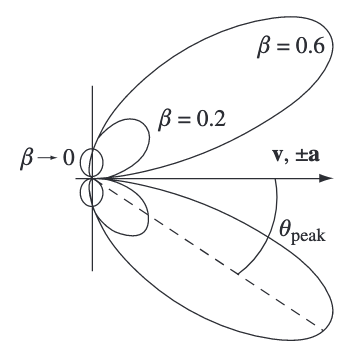

# 运动电荷的势、场与辐射

## *Liénard-Wiechert*问题

### *Liénard-Wiechert*势

#### 推迟势计算

¶对于运动电荷

$$
\rho_{f}(\bm{r},t)=q\delta(\bm{r}-\bm{r}_{0}(t)),\quad\bm{J}_{f}(\bm{r},t)=q\bm{v}(t)\delta(\bm{r}-\bm{r}_{0}(t)),
$$

计算其推迟势

$$
\begin{aligned}
\varphi^{(\text{L})}(\bm{r},t)&=\frac{1}{4\pi\varepsilon_{0}}\int\mathrm{d}^3\bm{r}'\frac{\rho_{f}(\bm{r}',t_{\text{ret}})}{\|\bm{r}-\bm{r}'\|}\\
&=\frac{q}{4\pi\varepsilon_{0}}\int\mathrm{d}^3\bm{r}'\int\mathrm{d} t'\frac{\delta(\bm{r}'-\bm{r}_{0}(t'))}{\|\bm{r}-\bm{r}'\|}\delta(t'-t_{\text{ret}})\\
&=\frac{q}{4\pi\varepsilon_{0}}\int\mathrm{d} t'\frac{\delta(t'-t+\|\bm{r}-\bm{r}_{0}(t')\|/c)}{\|\bm{r}_{}-\bm{r}_{0}(t')\|},
\end{aligned}
$$

因为带电粒子有质量不可能达到光速，故若记$g(t')=t'-t+\|\bm{r}-\bm{r}_{0}(t')\|/c$，$\bm{R}(t)=\bm{r}-\bm{r}_{0}(t)$则

$$
\frac{\mathrm{d}}{\mathrm{d}t'}g(t')=1-\bm{\beta}\cdot\hat{\bm{R}}(t')>0,
$$

又$g(t_{\text{ret}})=0$（这里$t_{\text{ret}}$重新定义为$g(t')=0 $的解），故

$$
\varphi^{(\text{L})}(\bm{r},t)=\frac{q}{4\pi\varepsilon_{0}}\left[\frac{1}{R(t)-\bm{\beta}\cdot\bm{R}(t)}\right]_{\text{ret}}.
$$

类似地

$$
\bm{A}^{(\text{L})}(\bm{r},t)=\frac{\mu_{0}q}{4\pi}\left[\frac{\bm{v}(t)}{R(t)-\bm{\beta}\cdot\bm{R}(t)}\right]_{\text{ret}}.
$$

#### *Lorenz*协变计算

¶在运动电荷的固有系中

$$
A^{\mu}|_{K_{0}}=\left(\left.\frac{1}{4\pi\varepsilon_{0}c}\frac{q}{R}\right|_{K_{0}},\bm{0}\right),
$$

考虑$R_{\mu}R^{\mu}=(R^{0})^2-R^2=0$，从而

$$
R|_{K_{0}}=R^{0}|_{K_{0}}=\Lambda^{0}_{\mu}(-\bm{v})R^{\mu}|_{K}=\gamma(R-\bm{\beta}\cdot\bm{R})|_{K},
$$

那么

$$
A^{\mu}|_{K}=\Lambda^{\mu}_{\nu}(\bm{v})A^{\nu}|_{K_{0}}=\left.\left(\frac{q}{4\pi\varepsilon_{0}c}\frac{1}{R(t)-\bm{\beta}\cdot\bm{R}(t)},\frac{\mu_{0}q}{4\pi}\frac{\bm{v}(t)}{R(t)-\bm{\beta}\cdot\bm{R}(t)}\right)\right|_{\text{ret}}.
$$

### *Liénard-Wiechert*场

¶由势计算场，记$g=1-\bm{\beta}\cdot\hat{\bm{R}}$，因为

$$
\begin{aligned}
&\nabla t_{\text{ret}}=-\frac{\hat{\bm{R}}_{\text{ret}}}{c}+(\bm{\beta}_{\text{ret}}\cdot\hat{\bm{R}}_{\text{ret}})\nabla t_{\text{ret}}\Longrightarrow\nabla t_{\text{ret}}=-\frac{\hat{\bm{R}}_{\text{ret}}}{cg_{\text{ret}}},\\
&\frac{\partial t_{\text{ret}}}{\partial t}=1+(\bm{\beta}_{\text{ret}}\cdot\hat{\bm{R}}_{\text{ret}})\frac{\partial t_{\text{ret}}}{\partial t}\Longrightarrow\frac{\partial t_{\text{ret}}}{\partial t}=\frac{1}{g_{\text{ret}}},
\end{aligned}
$$

故

$$
\begin{aligned}
\nabla g_{\text{ret}}&=-\frac{\partial (\bm{\beta}_{\text{ret}}\cdot\hat{\bm{R}}_{\text{ret}})}{\partial t_{\text{ret}}}\nabla t_{\text{ret}}-\frac{\bm{\beta}_{\text{ret}}-(\bm{\beta}_{\text{ret}}\cdot\hat{\bm{R}}_{\text{ret}})\hat{\bm{R}}_{\text{ret}}}{R_{\text{ret}}}\\
&=\left.\left\{-\left[\dot{\bm{\beta}}\cdot\hat{\bm{R}}-\frac{c\beta^2}{R}+\frac{c(\bm{\beta}\cdot\hat{\bm{R}})^2}{R}\right]\left(-\frac{\hat{\bm{R}}}{cg}\right)-\frac{\bm{\beta}-(\bm{\beta}\cdot\hat{\bm{R}})\hat{\bm{R}}}{R}\right\}\right|_{\text{ret}}\\
&=\left.\left\{\frac{1}{R}\left[-\frac{\hat{\bm{R}}}{g}|\bm{\beta}\times\hat{\bm{R}}|^2-\bm{\beta}+(\bm{\beta}\cdot\hat{\bm{R}})\hat{\bm{R}}\right]+\frac{(\dot{\bm{\beta}}\cdot\hat{\bm{R}})\hat{\bm{R}}}{cg}\right\}\right|_{\text{ret}},\\\\
\frac{\partial g_{\text{ret}}}{\partial t}&=-\frac{\partial (\bm{\beta}_{\text{ret}}\cdot\hat{\bm{R}}_{\text{ret}})}{\partial t_{\text{ret}}}\frac{\partial t_{\text{ret}}}{\partial t}\\
&=\left.\left\{-\left[\dot{\bm{\beta}}\cdot\hat{\bm{R}}-\frac{c\beta^2}{R}+\frac{c(\bm{\beta}\cdot\hat{\bm{R}})^2}{R}\right]\frac{1}{g}\right\}\right|_{\text{ret}}\\
&=\frac{c}{gR}|\bm{\beta}\times\hat{\bm{R}}|^2-\frac{\dot{\bm{\beta}}\cdot\hat{\bm{R}}}{g},
\end{aligned}
$$

那么

$$
\begin{aligned}
\bm{E}(\bm{r},t)&=-\nabla\varphi^{(\text{L})}-\frac{\partial \bm{A}^{(\text{L})}}{\partial t}\\
&=\frac{q}{4\pi\varepsilon_{0}}\left[\frac{(1-\beta^2)(\hat{\bm{R}}-\bm{\beta})}{g^3 R^2} + \frac{\hat{\bm{R}}\times\big((\hat{\bm{R}}-\bm{\beta})\times\dot{\bm{\beta}}\big)}{cg^3 R}\right]_{\text{ret}}\\
&=\bm{E}_{v}+\bm{E}_{a},\\\\
\bm{B}(\bm{r},t)&=\nabla\times\bm{A}^{(\text{L})}
=\frac{1}{c}\hat{\bm{R}}_{\text{ret}}\times\bm{E}
\equiv\bm{B}_{v}+\bm{B}_{a}.
\end{aligned}
$$

### *Heaviside-Feynman*场

¶考虑电磁场的其他表示形式

$$
\begin{aligned}
\bm{E}(\bm{r},t)&=-\frac{q}{4\pi\varepsilon_{0}}\nabla\int\mathrm{d} t'\frac{\delta(t'-t+R(t')/c)}{R(t')}-\frac{\mu_{0}q}{4\pi}\frac{\partial }{\partial t}\int\mathrm{d} t'\frac{\delta(t'-t+R(t')/c)\bm{v}(t')}{R(t')}\\
&=-\frac{q}{4\pi\varepsilon_{0}}\int\mathrm{d} t'\frac{1}{R(t')}\delta'(t'-t+R(t')/c)\nabla\left(\frac{R(t')}{c}\right)\\
&\quad-\frac{q}{4\pi\varepsilon_{0}}\int\mathrm{d} t'\delta(t'-t+R(t')/c)\nabla\left(\frac{1}{R(t')}\right)-\frac{\mu_{0}q}{4\pi}\frac{\partial }{\partial t}\int\mathrm{d} t'\frac{\delta(t'-t+R(t')/c)\bm{v}(t')}{R(t')}\\
&=\frac{q}{4\pi\varepsilon_{0}}\int\mathrm{d} t'\delta(t'-t+R(t')/c)\frac{\hat{\bm{R}}}{R^2}+\frac{\mu_{0}q}{4\pi}\frac{\partial }{\partial t}\int\mathrm{d} t'\delta(t'-t+R(t')/c)\frac{c\hat{\bm{R}}-\bm{v}}{R}\\
&=\frac{q}{4\pi\varepsilon_{0}}\left[\frac{\hat{\bm{R}}}{gR^2}\right]_{\text{ret}}+\frac{q}{4\pi\varepsilon_{0}}\frac{\partial }{\partial t}\left[\frac{\hat{\bm{R}}-\bm{\beta}}{cgR}\right]_{\text{ret}},\\\\
\bm{B}(\bm{r},t)&=\frac{\mu_{0}q}{4\pi}\nabla\times\int\mathrm{d} t'\frac{\delta(t'-t+R(t')/c)\bm{v}(t')}{R(t')}
=\frac{\mu_{0}q}{4\pi}\int\mathrm{d} t'\nabla\left[\frac{\delta(t'-t+R(t')/c)}{R}\right]\times\bm{v}\\
&=-\frac{\mu_{0}q}{4\pi}\int\mathrm{d} t'\delta(t'-t+R(t')/c)\frac{\hat{\bm{R}}}{R^2}\times\bm{v}-\frac{\mu_{0}q}{4\pi}\frac{\partial }{\partial t}\int\mathrm{d} t'\delta(t'-t+R(t')/c)\frac{\hat{\bm{R}}}{cR}\times\bm{v}\\
&=\frac{\mu_{0}q}{4\pi}\left[\frac{c\bm{\beta}\times\hat{\bm{R}}}{gR^2}\right]_{\text{ret}}+\frac{\mu_{0}q}{4\pi}\frac{\partial }{\partial t}\left[\frac{\bm{\beta}\times\hat{\bm{R}}}{gR}\right]_{\text{ret}}.
\end{aligned}
$$

由上一小节

$$
\begin{aligned}
\frac{1}{g_{\text{ret}}}=\frac{\partial t_{\text{ret}}}{\partial t}=1-\frac{1}{c}\frac{\partial R_{\text{ret}}}{\partial t},\quad\bm{\beta}_{\text{ret}}=-\frac{1}{c}\frac{\partial \bm{R}_{\text{ret}}}{\partial t_{\text{ret}}}=-\frac{g_{\text{ret}}}{c}\frac{\partial \bm{R}_{\text{ret}}}{\partial t},
\end{aligned}
$$

故

$$
\begin{aligned}
\bm{E}(\bm{r},t)&=\frac{q}{4\pi\varepsilon_{0}}\frac{\hat{\bm{R}}_{\text{ret}}}{R^2_{\text{ret}}}\left(1-\frac{1}{c}\frac{\partial R_{\text{ret}}}{\partial t}\right)+\frac{q}{4\pi\varepsilon_{0}}\frac{\partial }{\partial t}\left[\frac{\hat{\bm{R}}_{\text{ret}}}{cR_{\text{ret}}}\left(1-\frac{1}{c}\frac{\partial R_{\text{ret}}}{\partial t}\right)+\frac{1}{c^2R_{\text{ret}}}\frac{\partial \bm{R}_{\text{ret}}}{\partial t}\right]\\
&=\frac{q}{4\pi\varepsilon_{0}}\left\{\frac{\hat{\bm{R}}_{\text{ret}}}{R^2_{\text{ret}}}+\frac{1}{c}\left[\frac{\partial }{\partial t}\left(\frac{\hat{\bm{R}}_{\text{ret}}}{R_{\text{ret}}}\right)-\frac{\hat{\bm{R}}_{\text{ret}}}{R^2_{\text{ret}}}\frac{\partial R_{\text{ret}}}{\partial t}\right]+\frac{1}{c^2}\frac{\partial }{\partial t}\left(\frac{1}{R_{\text{ret}}}\frac{\partial \bm{R}_{\text{ret}}}{\partial t}-\frac{\hat{\bm{R}}_{\text{ret}}}{R_{\text{ret}}}\frac{\partial R_{\text{ret}}}{\partial t}\right)\right\}\\
&=\frac{q}{4\pi\varepsilon_{0}}\left[\frac{\hat{\bm{R}}_{\text{ret}}}{R^2_{\text{ret}}}+\frac{R_{\text{ret}}}{c}\frac{\partial }{\partial t}\left(\frac{\hat{\bm{R}}_{\text{ret}}}{R^2_{\text{ret}}}\right)+\frac{1}{c^2}\frac{\partial ^2\hat{\bm{R}}_{\text{ret}}}{\partial t^2}\right],\\\\
\bm{B}(\bm{r},t)&=\frac{\mu_{0}q}{4\pi}\frac{\hat{\bm{R}}_{\text{ret}}}{R^2_{\text{ret}}}\times\frac{\partial \bm{R}_{\text{ret}}}{\partial t}+\frac{\mu_{0}q}{4\pi c}\frac{\partial }{\partial t}\left(\frac{\hat{\bm{R}}_{\text{ret}}}{R_{\text{ret}}}\times\frac{\partial \bm{R}_{\text{ret}}}{\partial t}\right)\\
&=\frac{\mu_{0}q}{4\pi}\hat{\bm{R}}_{\text{ret}}\times\frac{\partial }{\partial t}\left(\frac{\hat{\bm{R}}_{\text{ret}}}{R_{\text{ret}}}\right)+\frac{\mu_{0}q}{4\pi}\frac{\hat{\bm{R}}_{\text{ret}}}{c}\times\frac{\partial ^2\hat{\bm{R}}_{\text{ret}}}{\partial t^2}.
\end{aligned}
$$

## 辐射场

### 时域

#### 发射功率的角分布

¶考虑$t_{1}\leq t'\leq t_{2}$内粒子向单位面积辐射出的能量，以不受观察者的相对运动影响，区分发射功率于接收功率

$$
\frac{\mathrm{d}U}{\mathrm{d}S}=\int_{t_{1}+R(t_{1})/c}^{t_{2}+R(t_{2})/c}[\bm{S}_{\text{rad}}\cdot\hat{\bm{R}}]_{\text{ret}}{\mathrm{d} t}=\int_{t_{1}}^{t_{2}}S_{\text{rad}}\frac{\mathrm{d}t}{\mathrm{d}t'}\mathrm{d} t'=\int_{t_{1}}^{t_{2}}\frac{g}{\mu_{0}c}E_{a}^2(t')\mathrm{d} t',
$$

即（以下讨论默认在$t'$系中，省去$\text{ret}$角标）

$$
\frac{\mathrm{d}P(t')}{\mathrm{d}\Omega}=\frac{gR^2}{\mu_{0}c}E_{a}^2(t')=\left(\frac{q}{4\pi\varepsilon_{0}}\right)^2\frac{|\hat{\bm{R}}\times((\hat{\bm{R}}-\bm{\beta})\times\dot{\bm{\beta}})|^2}{\mu_{0}c^3g^5}=\frac{q^2}{16\pi^2\varepsilon_{0}c}\frac{|\hat{\bm{R}}\times((\hat{\bm{R}}-\bm{\beta})\times\dot{\bm{\beta}})|^2}{(1-\bm{\beta}\cdot\hat{\bm{R}})^5}.
$$

低速情况$\beta\approx0$下退化为

$$
\frac{\mathrm{d}P}{\mathrm{d}\Omega}=\frac{\mu_{0}q^2a^2}{(4\pi)^2c}\sin^2\theta.
$$

#### $\dot{\bm{\beta}}\parallel\bm{\beta}$

¶此时

$$
\frac{\mathrm{d}P}{\mathrm{d}\Omega}=\frac{q^2}{16\pi^2\varepsilon_{0}c}\frac{|\hat{\bm{R}}\times\dot{\bm{\beta}}|^2}{(1-\bm{\beta}\cdot\hat{\bm{R}})^5}=\frac{\mu_{0}a^2}{16\pi^2c}\frac{\sin^2\theta}{(1-\beta\cos\theta)^5}.
$$

<figure class="image-round" style="--image-width:40%">
  
  <figcaption>
  
  图一：不同$\beta$值对应的角分布
  </figcaption>
</figure>

#### $\dot{\bm{\beta}}\perp\bm{\beta}$

¶此时设$\bm{v}=v\hat{\bm{z}},\ \bm{a}=a\hat{\bm{x}},\ \hat{\bm{R}}=\sin\theta\cos\varphi\hat{\bm{x}}+\sin\theta\sin\varphi\hat{\bm{y}}+\cos\theta\hat{\bm{z}}$

$$
\frac{\mathrm{d}P}{\mathrm{d}\Omega}=\frac{\mu_{0}a^2}{16\pi^2c}\frac{1}{(1-\beta\cos\theta)^3}\left[1-\frac{\sin^2\theta\cos^2\varphi}{\gamma^2(1-\beta\cos\theta)^2}\right].
$$

#### 广义*Lamor*公式（*Liénard*公式）

¶推导广义*Lamor*公式（任意速度运动粒子的总的发射功率）除了可将$\mathrm{d} P/\mathrm{d}\Omega$积分，也可由$P$的*Lorenz*不变性推导.定义四维辐射动量矢量$p_{\text{rad}}^{\mu}=(U_{\text{rad}}/c,\bm{p}_{\text{rad}})$.由固有系$K_{0}$中辐射动量关于对跖点的对称性$p^{\mu}|_{K_{0}}=(U_{\text{rad}}/c|_{K_{0}},\bm{0})$，即$\mathrm{d}\bm{p}_{\text{rad}}|_{K_{0}}=\bm{0}$.取$K_{0}$中积分球面上固定一点，得到$\mathrm{d} x^{\mu}|_{K_{0}}=(c\mathrm{d} t|_{K_{0}},\bm{0})$.于是

$$
P|_{K}=\left.\frac{\mathrm{d}U_{\text{rad}}}{\mathrm{d}t}\right|_{K}=\frac{c\Lambda^{0}_{\mu}(\bm{v})\mathrm{d} p_{\text{rad}}^{\mu}|_{K_{0}}}{\Lambda^{0}_{\nu}(\bm{v})\mathrm{d} x^{\nu}|_{K_{0}}/c}=\left.\frac{\mathrm{d}U_{\text{rad}}}{\mathrm{d}t}\right|_{K_{0}}=P|_{K_{0}},
$$

证明了$P$的*Lorenz*不变性.因此考虑推广*Lamor*公式

$$
\begin{aligned}
P&=-\frac{1}{4\pi\varepsilon_{0}}\frac{2q^2}{3c^3}\ddot{x}_{\mu}\ddot{x}^{\mu}=-\frac{1}{4\pi\varepsilon_{0}}\frac{2q^2}{3c^3m^2}\frac{\mathrm{d}p_{\mu}}{\mathrm{d}\tau}\frac{\mathrm{d}p^{\mu}}{\mathrm{d}\tau}\\
&=\frac{1}{4\pi\varepsilon_{0}}\frac{2q^2}{3c^3m^2}\left[\gamma^2c^2\left(\frac{\mathrm{d}\gamma m\bm{\beta}}{\mathrm{d}t}\right)^2-\frac{\gamma^2}{c^2}\left(\frac{\mathrm{d}\gamma mc^2}{\mathrm{d}t}\right)^2\right]\\
&=\frac{1}{4\pi\varepsilon_{0}}\frac{2q^2}{3c}\gamma^2\left[\left(\frac{\mathrm{d}\gamma\bm{\beta}}{\mathrm{d}t}\right)^2-\left(\frac{\mathrm{d}\gamma}{\mathrm{d}t}\right)^2\right]\\
&=\frac{1}{4\pi\varepsilon_{0}}\frac{2q^2}{3c}\gamma^6\left[\dot{\beta}^2-(\bm{\beta}\times\dot{\bm{\beta}})^2\right].
\end{aligned}
$$

### 频域

## *Cherenkov*辐射

## 粒子的辐射反应
