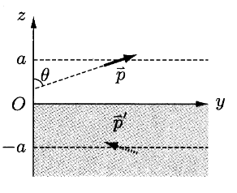
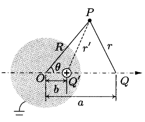
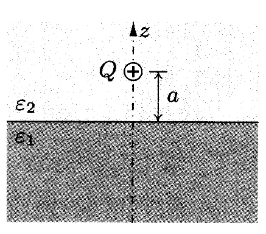

## 点电偶极子的电荷密度

\par点电荷的电势
$$
\varphi_{0}(\bm{r})=\frac{1}{4\pi\varepsilon_{0}}\frac{q}{r},
$$
点电偶极子的电势
$$
\begin{aligned}
\varphi_{d}(\bm{r})&=\lim_{l/r\to0}\varphi_{0}(\bm{r}-\bm{l}/2)-\varphi_{0}(\bm{r}+\bm{l}/2)\\
&=\lim_{l/r\to0}\sum_{i=0}^{\infty}\frac{1}{i!}\left[\left(-\frac{\bm{l}}{2}\cdot\nabla\right)^{i}-\left(\frac{\bm{l}}{2}\cdot\nabla\right)^{i}\right]\varphi_{0}(\bm{r})\\
&=\lim_{l/r\to0}-\bm{l}\cdot\nabla\varphi_{0}(\bm{r})+O(l^3/r^3)\\
&=-\frac{1}{4\pi\varepsilon_{0}}\bm{p}\cdot\nabla\frac{1}{r},
\end{aligned}
$$
电荷分布
$$
\begin{aligned}
\rho_{d}&=-\varepsilon_{0}\nabla^2\varphi_{d}\\
&=-\frac{1}{4\pi}\nabla\cdot\left[\bm{p}\times\left(\nabla\times\nabla\frac{1}{r}\right)+(\bm{p}\cdot\nabla)\nabla\frac{1}{r}+\nabla\frac{1}{r}\times(\nabla\times\bm{p})+\left(\nabla\frac{1}{r}\cdot\nabla\right)\bm{p}\right]\\
&=-\nabla\cdot\left[(\bm{p}\cdot\nabla)\left(-\frac{1}{4\pi}\nabla\frac{1}{r}\right)\right]\\
&=-\bm{p}\cdot\nabla\delta(\bm{r}).
\end{aligned}
$$
也可参见[Dirac函数的展开](../append/Chap_02.md#dirac函数的展开)直接计算
$$
    \begin{aligned}
    \rho_{d}&=q\delta(\bm{r}-\bm{l}/2)-q\delta(\bm{r}+\bm{l}/2)
    \\&=q\left(\delta(\bm{r})-\frac{\bm{l}}{2}\cdot\nabla\delta(\bm{r})\right)-q\left(\delta(\bm{r})+\frac{\bm{l}}{2}\cdot\nabla\delta(\bm{r})\right)\\
    &=-\bm{p}\cdot\nabla\delta(\bm{r}).
    \end{aligned}
$$

## 电偶极子层两侧电势差

\par考察电偶极子层在点$K$引起的电势
$$
    \begin{aligned}
    \varphi_{K}&=\frac{1}{4\pi\varepsilon_0}\int_{S}\frac{-\sigma_{e}\upd f'}{|\bm{r}_{K}-\bm{r}'|}+\frac{\sigma_{e}\upd f'}{|\bm{r}_{K}-(\bm{r}'+\bm{d})|}\\
    &=\frac{1}{4\pi\varepsilon_0}\int_{S}\upd f'\sigma_{e}(-d\bm{e}_{n})\cdot\nabla\frac{1}{|\bm{r}_{K}-\bm{r}'|}\\
    &=-\frac{D_{e}}{4\pi\varepsilon_0}\int_{S}\upd\bm{f}'\cdot\nabla\frac{1}{|\bm{r}_{K}-\bm{r}'|}\\
    &=-\frac{D_{e}}{\varepsilon_0}\frac{\Omega_{K}}{4\pi},
    \end{aligned}
$$
其中称$D_{e}=\sigma_{e}d$为电偶极子面密度，$\Omega_{K}$为$S$相对于$K$的立体角，其微元$\upd\Omega_{K}$与$\upd\bm{f}'\cdot(\bm{r}'-\bm{r}_{K})$符号相同.对于无穷延伸的电偶极子层或闭合电偶极子层
$$
\Omega_{-}-\Omega_{+}=4\pi,
$$
故此时两侧电势差
$$
\Delta\varphi_{D}=\varphi_{-}-\varphi_{+}=-\frac{D_{e}}{\varepsilon_0}.
$$

## 导体组的能量

\par设导体组有$n$个导体$\Sigma_{i},\ i=1,\cdots,n$，其电势为$U_{1},\cdots,U_{n}$，导体间介质的电荷分布$\rho_{f}$，设电势可分解为
$$
\varphi(\bm{r};U_{1},\cdots,U_{n};\rho_{f})=\varphi_{0}(\bm{r};0,\cdots,0;\rho_{f})+\sum_{i=1}^{n}U_{i}\chi_{i}(\bm{r}),
$$
其中
$$
\begin{aligned}
&\nabla^2\chi_{i}(\bm{r})=0,\\
&\chi_{i}(\bm{r})=\delta_{ij},\ \forall\bm{r}\in\Sigma_{j},
\end{aligned}
$$
此分解满足*Poisson*方程和边界条件，由唯一性定理保证唯一.第$i$个导体上的电荷
$$
Q_{i}=-\int_{\partial\Sigma_{i}}\part{\varphi}{n}\ \upd f'=-\int_{\partial\Sigma_{i}}\part{\varphi_{0}}{n}\ \upd f'+\sum_{j=1}^{n}\left(-\int_{\partial\Sigma_{i}}\part{\chi_{j}}{n}\ \upd f'\right)U_{j}\equiv q_{i}+\sum_{i=1}^{n}C_{ij}U_{j},
$$
即
$$
\bm{Q}=\bm{q}+\mathcal{C}\bm{U},
$$
$\mathcal{C}$为导体组电容张量.导体组的能量
$$
W=\bm{U}^{T}\bm{Q}=\bm{U}^{T}\bm{q}+\bm{U}^{T}\mathcal{C}\bm{U}.
$$

## 点电四极子的电四极矩

\par点电四极子由一组相距$\bm{d}\ (d\to0)$的反向点电偶极子构成，其电荷分布
$$
    \begin{aligned}
    \rho_{q}&=-\bm{p}\cdot\nabla\delta(\bm{r}-\bm{d}/2)+\bm{p}\cdot\nabla\delta(\bm{r}+\bm{d}/2)\\
    &=-\bm{p}\cdot\nabla\left(\delta(\bm{r})-\frac{\bm{d}}{2}\cdot\nabla\delta(\bm{r})\right)+\bm{p}\cdot\nabla\left(\delta(\bm{r})+\frac{\bm{d}}{2}\cdot\nabla\delta(\bm{r})\right)\\
    &=(\bm{p}\cdot\nabla)(\bm{d}\cdot\nabla)\delta(\bm{r}),
    \end{aligned}
$$
其电四极矩$\mathcal{Q}$分量
$$
\begin{aligned}
\mathcal{Q}_{ij}&=\int_{V}\rho_{q}(\bm{r}')(3x'_ix'_j-\delta_{ij}(r')^2)\ \upd^3\bm{r}'\\
&=\langle(\bm{p}\cdot\nabla)(\bm{d}\cdot\nabla)\delta(\bm{r}'),3x'_ix'_j-\delta_{ij}(r')^2\rangle\\
&=\langle\delta(\bm{r}'),(\bm{p}\cdot\nabla)(\bm{d}\cdot\nabla)(3x'_ix'_j-\delta_{ij}(r')^2)\rangle\\
&=\frac{3}{2}(2-\delta_{ij})(p_id_j+p_jd_i)-\delta_{ij}\bm{p}\cdot\bm{d}\\
&=(3-2\delta_{ij})(p_id_j+p_jd_i).
\end{aligned}
$$

## 接地金属表面附近的电偶极子

<figure class="image-round" style="--image-width:30%;--broader-radius:10px;">
  
</figure>

\par镜像电偶极子
$$
\bm{p}'=-p\sin\theta\hat{\bm{e}}_{y}+p\cos\theta\hat{\bm{e}}_{z},
$$
其在电偶极子处激发电场
$$
\bm{E}=\frac{1}{4\pi\varepsilon_{0}}\frac{3(\bm{p}'\cdot\hat{\bm{e}}_{z})\hat{\bm{e}}_{z}-\bm{p}'}{(2a)^3}=\frac{1}{4\pi\varepsilon_{0}}\frac{p\sin\theta\hat{\bm{e}}_{y}+2p\cos\theta\hat{\bm{e}}_{z}}{(2a)^3},
$$
计算$\theta$缓慢从$\pi/2$到$0$，电场力做功
$$
\begin{aligned}
W&=\int_{0}^{\pi/2}(\bm{p}\times\bm{E})\cdot\ \hat{\bm{e}}_{x}\upd\theta
\\&=\frac{1}{4\pi\varepsilon_{0}}\frac{p^2}{(2a)^3}\int_{0}^{\pi/2}\sin\theta\cos\theta\ \upd\theta\\
&=\frac{p^2}{64\pi\varepsilon_{0}a^3}.
\end{aligned}
$$

## 金属导体球附近的点电荷

<figure class="image-round" style="--image-width:30%;--broader-radius:10px;">
  
</figure>

\par由几何关系容易求得
$$
ab=R_{0}^2,\quad\frac{Q}{\sqrt{a}}+\frac{Q'}{\sqrt{b}}=0.
$$

## 无限大介质分界面附近的点电荷

<figure class="image-round" style="--image-width:30%;--broader-radius:10px;">
  
</figure>

\par介质分界面上有边值关系
$$
\begin{aligned}
&\varphi_{1}|_{z=0}=\varphi_{2}|_{z=0},\\
&\left.\left(\varepsilon_{2}\part{\varphi_{2}}{z}-\varepsilon_{1}\part{\varphi_{1}}{z}\right)\right|_{z=0}=0,
\end{aligned}
$$
$z$轴上$z=a$处已有一个极化电荷和自由电荷叠加而成的电荷$\dfrac{\varepsilon_{0}}{\varepsilon_{2}}Q$.出于镜像电荷选取的简便，先考虑在$z$轴上选取点电荷，该电荷的电势应为$1/\sqrt{x^2+y^2+(z-z_0)^2}$的形式，为了满足边值关系和已有电荷分布，应取$z_{0}=\pm a$的两假设电荷$Q_1,\ Q_2$，且注意假设电荷只能位于其电势贡献区域以外，故假设
$$
\begin{aligned}
\varphi_{1}&=\frac{1}{4\pi\varepsilon_{0}}\frac{\frac{\varepsilon_{0}}{\varepsilon_{2}}Q+Q_1}{\sqrt{x^2+y^2+(z-a)^2}},\\
\varphi_{2}&=\frac{1}{4\pi\varepsilon_{0}}\frac{\frac{\varepsilon_{0}}{\varepsilon_{2}}Q}{\sqrt{x^2+y^2+(z-a)^2}}+\frac{1}{4\pi\varepsilon_{0}}\frac{Q_2}{\sqrt{x^2+y^2+(z+a)^2}},
\end{aligned}
$$
带入边值关系
$$
\begin{aligned}
&\frac{\varepsilon_{0}}{\varepsilon_{2}}Q+Q_1=\frac{\varepsilon_{0}}{\varepsilon_{2}}Q+Q_2,\\
&-\varepsilon_{0}Q+\varepsilon_{2}Q_{2}+\varepsilon_{1}\left(\frac{\varepsilon_{0}}{\varepsilon_{2}}Q+Q_1\right)=0,
\end{aligned}
$$
解得
$$
Q_{1}=Q_{2}=\frac{\varepsilon_{0}}{\varepsilon_{2}}\frac{\varepsilon_{2}-\varepsilon_{1}}{\varepsilon_{1}+\varepsilon_{2}}Q,
$$
故
$$
\begin{aligned}
\varphi_{1}&=\frac{1}{2\pi(\varepsilon_{1}+\varepsilon_{2})}\frac{Q}{\sqrt{x^2+y^2+(z-a)^2}},\\
\varphi_{2}&=\frac{1}{4\pi\varepsilon_{2}}\frac{Q}{\sqrt{x^2+y^2+(z-a)^2}}+\frac{1}{4\pi\varepsilon_{2}}\frac{\varepsilon_{2}-\varepsilon_{1}}{\varepsilon_{1}+\varepsilon_{2}}\frac{Q}{\sqrt{x^2+y^2+(z+a)^2}}.
\end{aligned}
$$
可求得介质分界面的极化电荷密度
$$
\begin{aligned}
\sigma_{p}&=(\bm{P}_{2}-\bm{P}_{1})\cdot(-\hat{\bm{e}}_{z})\\
&=\left[(\varepsilon_{1}-\varepsilon_{0})\bm{E}_{1}-(\varepsilon_{2}-\varepsilon_{0})\bm{E}_{2}\right]\cdot\hat{\bm{e}}_{z}\\
&=(\varepsilon_{2}-\varepsilon_{0})\part{\varphi_{2}}{z}-(\varepsilon_{1}-\varepsilon_{0})\part{\varphi_{1}}{z}\\
&=\varepsilon_{0}\left(\part{\varphi_{1}}{z}-\part{\varphi_{2}}{z}\right)\\
&=\frac{\varepsilon_{0}aQ}{4\pi r^3}\left(\frac{2}{\varepsilon_{1}+\varepsilon_{2}}-\frac{1}{\varepsilon_{2}}+\frac{1}{\varepsilon_{2}}\frac{\varepsilon_{2}-\varepsilon_{1}}{\varepsilon_{1}+\varepsilon_{2}}\right)\\
&=\frac{\varepsilon_{0}}{4\pi\varepsilon_{2}}\frac{\varepsilon_{2}-\varepsilon_{1}}{\varepsilon_{1}+\varepsilon_{2}}\frac{2aQ}{r^3},
\end{aligned}
$$
总极化电荷
$$
\begin{aligned}
Q_{p}&=\int_{S}\sigma_{p}\ \upd f=2\pi\int_{0}^{\infty}\frac{\varepsilon_{0}}{4\pi\varepsilon_{2}}\frac{\varepsilon_{2}-\varepsilon_{1}}{\varepsilon_{1}+\varepsilon_{2}}\frac{2aQ}{(a^2+\rho^2)^{3/2}}\ \rho\upd\rho\\
&=\frac{\varepsilon_{0}}{\varepsilon_{2}}\frac{\varepsilon_{2}-\varepsilon_{1}}{\varepsilon_{1}+\varepsilon_{2}}aQ\left[-\frac{1}{\sqrt{a^2+\rho^2}}\right]_{\rho=0}^{\infty}\\
&=\frac{\varepsilon_{0}}{\varepsilon_{2}}\frac{\varepsilon_{2}-\varepsilon_{1}}{\varepsilon_{1}+\varepsilon_{2}}Q,
\end{aligned}
$$
验证了镜像电荷的结果.

## 放置于匀强电场中的介质球

\par假设
$$
\varphi(r,\theta)=\leftBrace&\sum_{n=0}^{\infty}\left(a_{n}r^{n}+\frac{b_{n}}{r^{n+1}}\right)P_{n}(\cos\theta),\ r\leq r_0,\\
&\sum_{n=0}^{\infty}\left(c_{n}r^{n}+\frac{d_{n}}{r^{n+1}}\right)P_{n}(\cos\theta),\ r>r_0,
\rightEnd
$$
考察$r\gg r_0$的情况，此时$\varphi\sim-r E_{0}\cos\theta$，得到$c_{n}=-\delta_{1n}E_{0}$，且根据球内自然条件$b_n=0$.考虑边值关系
$$
\leftBrace
&\varphi(r_{0})=\lim_{r\to r_{0}^{+}}\varphi(r),\\
&\left.\varepsilon_{0}\part{\varphi}{r}\right|_{r_0^+}-\varepsilon\left.\part{\varphi}{r}\right|_{r_0}=0,
\rightEnd\Longrightarrow
\leftBrace
&a_n r_0^n=-\delta_{1n}E_{0}r_0^n+\frac{d_n}{r_0^{n+1}},\\
&\varepsilon_{0}\left(-\delta_{1n}nE_{0}r_{0}^{n-1}-(n+1)\frac{d_n}{r_0^{n+2}}\right)-\varepsilon na_nr_0^{n-1}=0,
\rightEnd
$$
解得
$$
a_n=-\frac{3\delta_{1n}\varepsilon_{0}}{\varepsilon+2\varepsilon_{0}}E_{0},\quad d_{n}=\frac{\delta_{1n}(\varepsilon-\varepsilon_{0})}{\varepsilon+2\varepsilon_{0}}r_0^3 E_{0},
$$
故
$$
\varphi(r,\theta)=\leftBrace
&-\frac{3\varepsilon_{0}}{\varepsilon+2\varepsilon_{0}}E_{0}r\cos\theta,\ r\leq r_0,\\
&\left(-E_{0}r+\frac{\varepsilon-\varepsilon_{0}}{\varepsilon+2\varepsilon_{0}}\frac{r_0^3}{r^2}E_{0}\right)\cos\theta,\ r>r_0.
\rightEnd
$$
