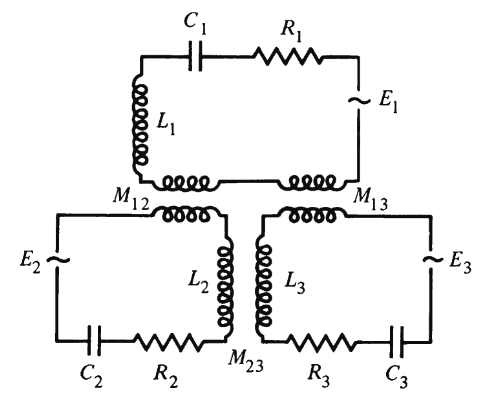

## 最速降线

$$
\begin{aligned}
J&=\int_{1}^{2}\frac{\mathrm{d}s}{v}=\int_{x_1}^{x_2}\frac{\sqrt{1+\dot{y}^2}}{\sqrt{2\mathrm{g}y}}\ \mathrm{d}x\equiv\int_{x_1}^{x_2}f(y,\dot{y},x)\ \mathrm{d}x,
\end{aligned}
$$
根据拉普拉斯方程
$$
\begin{aligned}
\part{f}{y}-\deri{}{x}\part{f}{\dot{y}}&=\frac{1}{\sqrt{2\mathrm{g}}}\left(-\frac{\sqrt{1+\dot{y}^2}}{2y^{3/2}}-\deri{}{x}\frac{\dot{y}}{y^{1/2}\sqrt{1+\dot{y}^2}}\right)\\
&=\frac{1}{\sqrt{2\mathrm{g}}}\left(-\frac{\sqrt{1+\dot{y}^2}}{2y^{3/2}}-\frac{\ddot{y}y^{1/2}\sqrt{1+\dot{y}^2}-\dot{y}(\dot{y}\sqrt{1+\dot{y}^2}/2y^{1/2}+\dot{y}\ddot{y}y^{1/2}/\sqrt{1+\dot{y}^2})}{y(1+\dot{y}^2)}\right)\\&=\frac{1}{\sqrt{2\mathrm{g}}}\left(-\frac{\sqrt{1+\dot{y}^2}}{2}y^{-3/2}-\frac{\ddot{y}y^{-1/2}}{\sqrt{1+\dot{y}^2}}+\frac{\dot{y}^2}{2\sqrt{1+\dot{y}^2}}y^{-3/2}+\frac{\dot{y}^2}{(1+\dot{y}^2)^{3/2}}\ddot{y}y^{-1/2}\right)\\
&=\frac{1}{\sqrt{2\mathrm{g}}}\left[\frac{y^{-3/2}}{2\sqrt{1+\dot{y}^2}}(-1-\dot{y}^2+\dot{y}^2)+\frac{\ddot{y}y^{-1/2}}{\sqrt{1+\dot{y}^2}}(-1+\dot{y}^2/(1+\dot{y}^2))\right]\\
&=-\frac{y^{-3/2}}{2\sqrt{2\mathrm{g}(1+\dot{y}^2)}}\left(1+\frac{2\ddot{y}y}{1+\dot{y}^2}\right)=0.
\end{aligned}
$$
求解微分方程
$$
\leftBrace
&1+2y\ddot{y}/(1+\dot{y}^2)=0,\\
&y(x_1)=y_1,\ y(x_2)=y_2.
\rightEnd
$$
因为
$$\ddot{y}=\dot{y}\deri{\dot{y}}{y},$$
方程化为
$$
\frac{\mathrm{d}y}{y}+\frac{2\dot{y}\mathrm{d}\dot{y}}{1+\dot{y}^2}=0,
$$
即
$$
1+\dot{y}^2=\frac{C}{y}\Longleftrightarrow
x=\int\sqrt{\frac{y}{C-y}}\ \mathrm{d}y.
$$
令
$$
y=\frac{C}{2}(1-\cos\theta),
$$
则
$$
x=\int\sqrt{\frac{1-\cos\theta}{1+\cos\theta}}\ \frac{C}{2}\sin\theta\mathrm{d}\theta=C\int\sin^2\frac{\theta}{2}\ \mathrm{d}\theta=\frac{C}{2}(\theta-\sin\theta)+C'.
$$
## 半圆形坡面滑落

$$
\begin{aligned}
&L=\frac{1}{2}m(\dot{x}^2+\dot{y}^2+\dot{z}^2)-m\upg z,\\
&f(x,z)=x^2+z^2-r^2=0.
\end{aligned}
$$
拉格朗日方程
$$
\begin{aligned}
&\delt{L}{x}+\lambda\part{f}{x}=-m\ddot{x}+2\lambda x=0,\\
&\delt{L}{z}+\lambda\part{f}{z}=-m\upg-m\ddot{z}+2\lambda z=0.
\end{aligned}
$$
令$x=r\cos\theta,\ z=r\sin\theta,$
$$
\begin{aligned}
\sin\theta\cdot \ddot{\theta}+\cos\theta\cdot\dot{\theta}^2+\frac{2\lambda}{m}\cos\theta&=0,\\
-\cos\theta\cdot\ddot{\theta}+\sin\theta\cdot\dot{\theta}^2-\frac{\upg}{r}+\frac{2\lambda}{m}\sin\theta&=0.
\end{aligned}
$$
将第一式乘$\cos\theta$，第二式乘$\sin\theta$后相加
$$
\dot{\theta}^2+\frac{2\lambda}{m}-\frac{\upg}{r}\sin\theta=0,\tag{1}
$$
类似地
$$
\ddot{\theta}+\frac{\upg}{r}\cos\theta=0.
$$
注意$\dot{\theta}|_{\theta=\pi/2}=0$，积分得
$$
    \dot{\theta}^2=\frac{2\upg}{r}(1-\sin\theta),
$$
带入(1)式得
$$
\lambda=\frac{m\upg}{2r}(3\sin\theta-2),
$$
因为$2\lambda r$是约束力，故$\lambda=0$时滑块脱离坡面，此时$\sin\theta_0=2/3$.

## 椭圆形坡面滑落

若在上一例中
$$
f(x,z)=\frac{x^2}{a^2}+\frac{z^2}{b^2}-1=0.
$$
则
$$
\begin{aligned}
-m\ddot{x}+\frac{2\lambda}{a^2}x&=0,\\
-m\upg-m\ddot{z}+\frac{2\lambda}{b^2}z&=0.
\end{aligned}
$$
令$x=a\cos\theta,\ z=b\sin\theta,$
$$
\begin{aligned}
\sin\theta\cdot \ddot{\theta}+\cos\theta\cdot\dot{\theta}^2+\frac{2\lambda}{ma^2}\cos\theta&=0,\\
-\cos\theta\cdot\ddot{\theta}+\sin\theta\cdot\dot{\theta}^2-\frac{\upg}{b}+\frac{2\lambda}{mb^2}\sin\theta&=0.
\end{aligned}
$$
得到
$$
\begin{equation}
\begin{aligned}
\dot{\theta}^2-\frac{\upg}{b}\sin\theta+\frac{2\lambda}{m}\left(\frac{\cos^2\theta}{a^2}+\frac{\sin^2\theta}{b^2}\right)&=0,&(\text{a})\\
\ddot{\theta}+\frac{\upg}{b}\cos\theta+\frac{2\lambda}{m}\left(\frac{1}{a^2}-\frac{1}{b^2}\right)\sin\theta\cos\theta&=0.&(\text{b})
\end{aligned}
\end{equation}
$$
消去$\lambda$
$$
\ddot{\theta}+\frac{\upg}{b}\cos\theta+\frac{(a^2-b^2)\sin\theta\cos\theta}{a^2\sin^2\theta+b^2\cos^2\theta}\left(\dot{\theta}^2-\frac{\upg}{b}\sin\theta\right)=0,
$$
记
$$
A(\theta)=a^2\sin^2\theta+b^2\cos^2\theta,
$$
则
$$
\begin{aligned}
&A(\theta)\ddot{\theta}+\frac{\upg}{b}\left(A(\theta)\cos\theta-\frac{A'(\theta)}{2}\sin\theta\right)+\frac{A'(\theta)}{2}\dot{\theta}^2\\
=&A(\theta)\ddot{\theta}+\upg b\cos\theta+\frac{A'(\theta)}{2}\dot{\theta}^2\\
=&\deri{}{\theta}\left(\frac{1}{2}A(\theta)\dot{\theta}^2+\upg b\sin\theta\right)=0,
\end{aligned}
$$
结合初始条件$\dot{\theta}|_{\theta=0}=0$
$$
\dot{\theta}^2=\frac{2\upg b(1-\sin\theta)}{A(\theta)}.
$$
$\lambda=0$时约束力为零，滑块滑落，此时由(1-a)式
$$
    \dot{\theta}^2|_{\lambda=0}=\frac{\upg}{b}\sin\theta_{0}=\frac{2\upg b(1-\sin\theta_{0})}{A(\theta_{0})},
$$
解得
$$
(a^2-b^2)\sin^3\theta_0+3b^2\sin\theta_0-2b^2=0.
$$
## 串联RL电路
\par定义从$t=0$时刻起流经电路某一截面的净电荷为$q$，参照[Stokes型阻力系统的拉格朗日方程](../chapters/Chap_01.md#非保守力情形)
$$
\mathcal{L}=T=\frac{1}{2}L\dot{q}^2,\quad \mathcal{F}=\frac{1}{2}R\dot{q}^2,\quad Q=\mathscr{E},    
$$
$\mathscr{E}$是电源电动势.得到
$$
\mathscr{E}=L\ddot{q}+R\dot{q}=L\dot{I}+RI.    
$$
## 耦合电路
<figure class="image-round" style="--image-width:40%;--broader-radius:10px;">
  
  <figcaption> 图一:由三个RLC电路组成的耦合电路</figcaption>
</figure>

\par在第$j$个电路中，广义力
$$\left.\begin{aligned}
Q_j=\mathscr{E}_j(t)&\\
Q_j=-\part{U_{Q}}{q_j}&
\end{aligned}\right\}
\Rightarrow U_{Q}=-q_j\mathscr{E}_{j}(t),
$$
故拉格朗日量
$$
\mathcal{L}=\sum_{j}\frac{1}{2}L_{j}\dot{q}_{j}^2+\sum_{\substack{j,k\\j\neq k}}\frac{1}{2}M_{jk}\dot{q}_j\dot{q}_k-\left(\sum_{j}\frac{q_j^2}{2C_j}-\sum_{j}q_j\mathscr{E}_j(t)\right).
$$
*Rayleigh*耗散函数
$$
\mathcal{F}=\sum_{j}\frac{1}{2}R_{j}\dot{q}_{j}^2.
$$
由拉格朗日方程
$$
-\delt{\mathcal{L}}{q_j}+\part{\mathcal{F}}{\dot{q}_j}=0,    
$$
得到
$$
L_j\ddot{q}_j+\sum_{\substack{k\\k\neq j}}M_{jk}\ddot{q}_{k}+R_j\dot{q}_j+\frac{q_j}{C_j}-\mathscr{E}_{j}(t)=0.
$$
## 点变换不变性
\par*Laplace*方程在点变换$q^k=q^k(s^j,t)$引入的坐标$\{s^j\}$下形式不变.
因为
$$L=L(q^k(s^j,t),\dot{q}^k(s^j,\dot{s}^j,t),t),$$
那么$$
\part{}{s^j}=\part{}{q^k}\part{q^k}{s^j}+\part{}{\dot{q}^k}\part{\dot{q}^k}{s^j},\quad\part{}{\dot{s}^j}=\part{}{\dot{q}^k}\part{\dot{q}^k}{\dot{s}^j}=\part{}{\dot{q}^k}\part{q^k}{s^j},
$$
得到
$$
\begin{aligned}
\deri{}{t}\left(\part{L}{\dot{s}^j}\right)-\part{L}{s^j}&=\deri{}{t}\left(\part{q^k}{s^j}\part{L}{\dot{q}^k}\right)-\part{q^k}{s^j}\part{L}{q^k}-\part{L}{\dot{q}^k}\part{\dot{q}^k}{s^j}\\
&=\left(\deri{}{t}\part{L}{\dot{q}^k}-\part{L}{q^k}\right)\part{q^k}{s^j}+\left(\deri{}{t}\part{q^k}{s^j}-\part{\dot{q}^k}{s^j}\right)\part{L}{\dot{q}^k}=0.
\end{aligned}
$$